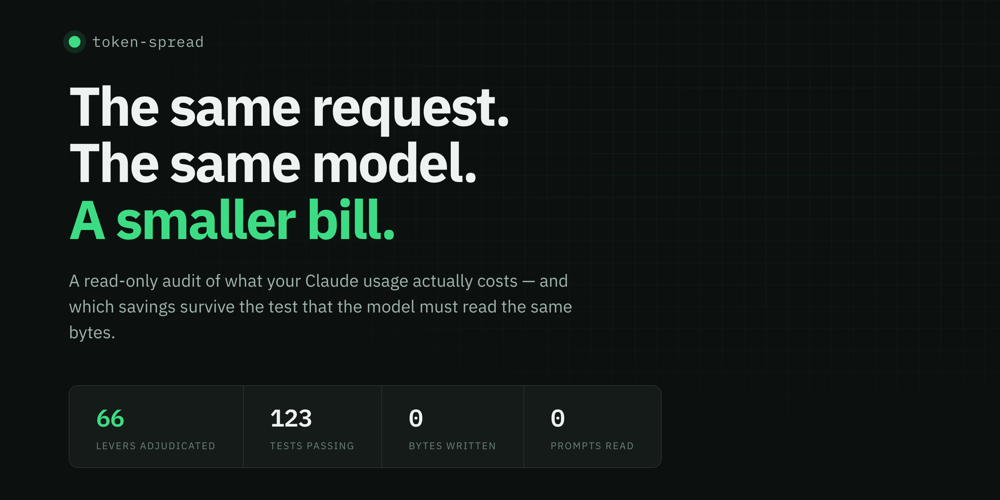
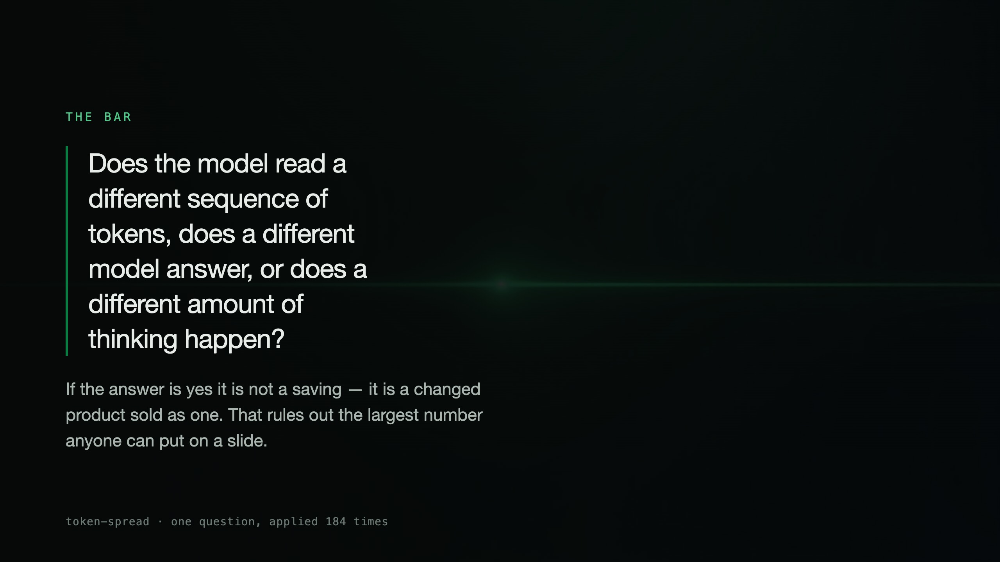
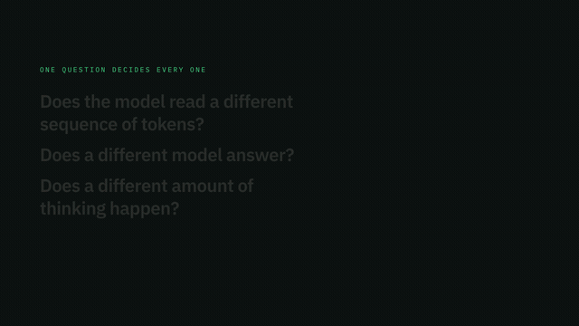
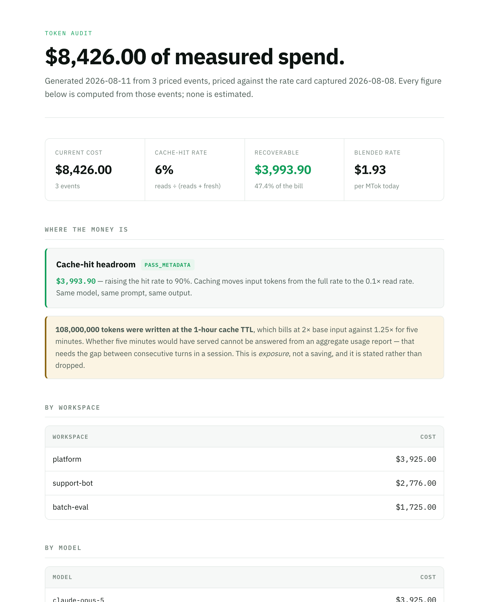
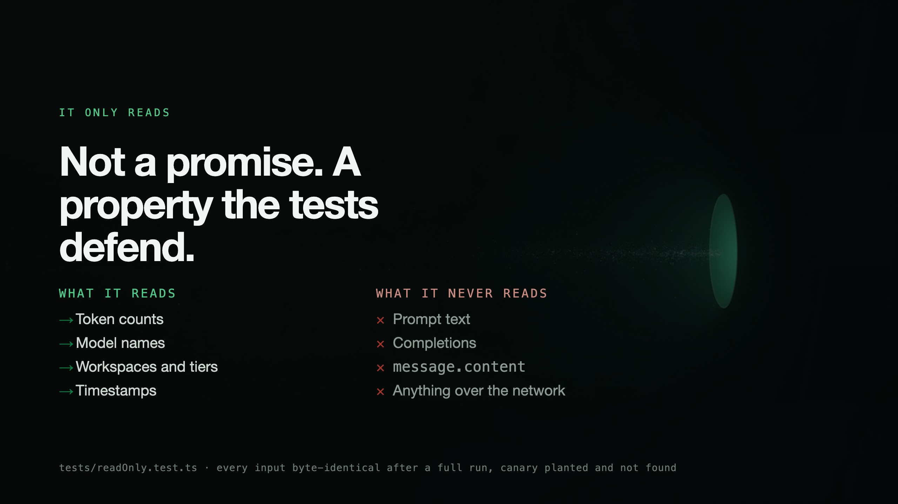
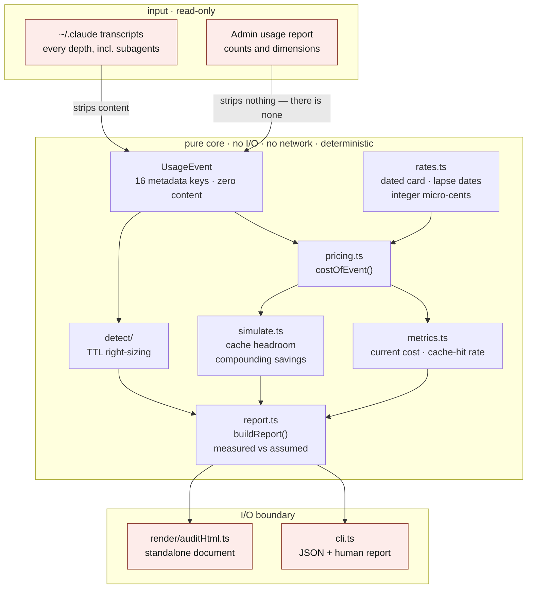
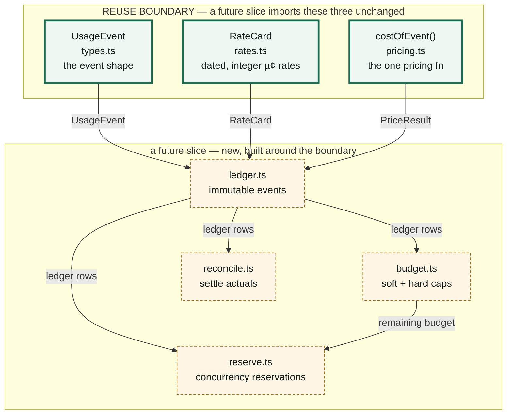
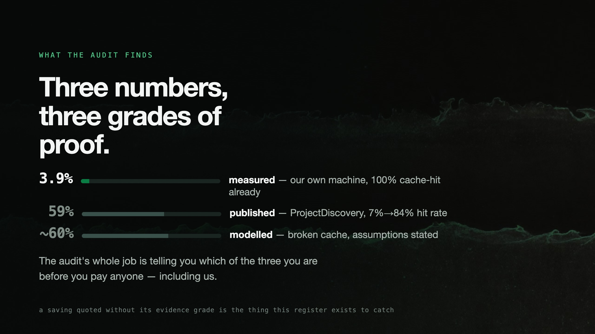
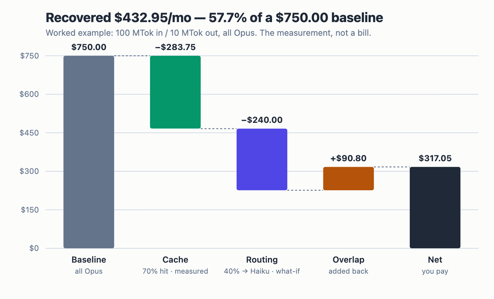
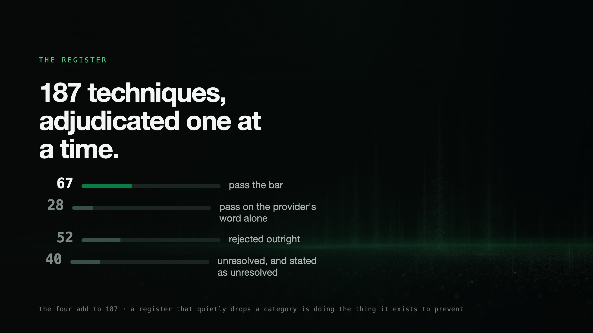

# token-spread

```
████████╗ ██████╗ ██╗  ██╗███████╗███╗   ██╗    ███████╗██████╗ ██████╗ ███████╗ █████╗ ██████╗
╚══██╔══╝██╔═══██╗██║ ██╔╝██╔════╝████╗  ██║    ██╔════╝██╔══██╗██╔══██╗██╔════╝██╔══██╗██╔══██╗
   ██║   ██║   ██║█████╔╝ █████╗  ██╔██╗ ██║    ███████╗██████╔╝██████╔╝█████╗  ███████║██║  ██║
   ██║   ██║   ██║██╔═██╗ ██╔══╝  ██║╚██╗██║    ╚════██║██╔═══╝ ██╔══██╗██╔══╝  ██╔══██║██║  ██║
   ██║   ╚██████╔╝██║  ██╗███████╗██║ ╚████║    ███████║██║     ██║  ██║███████╗██║  ██║██████╔╝
   ╚═╝    ╚═════╝ ╚═╝  ╚═╝╚══════╝╚═╝  ╚═══╝    ╚══════╝╚═╝     ╚═╝  ╚═╝╚══════╝╚═╝  ╚═╝╚═════╝
```

<div align="center">


<br>



<br>

**Make the tokens you already pay for go further — and keep the difference.**

</div>

Not by minting tokens. Not by reselling a subscription's quota (banned, and repriced to zero
margin). By serving the **same request to the same model** more cheaply than the customer can buy
it direct. That gap is the business, and it survives scrutiny only because nothing about the
request changes.

token-spread is two things built to the same discipline. First, a **276-test**, zero-runtime-
dependency Bun/TypeScript CLI (**4,186** lines of source) that reads local Claude Code transcripts
or an Anthropic admin usage report and turns real token counts into a report on what your spend
actually is and what caching could recover — reads only, writes nothing you didn't ask for.
Second, a **371-entry adjudicated register**, built across seventeen research sweeps into eight
published cohort files, that grades every LLM cost-reduction technique anyone has proposed against
one falsifiable question. **81 pass outright. 95 pass only on the provider's word. 135 are
rejected. 60 are still unresolved and published as unresolved anyway.** 63 of those 371 entries
carry at least one dated, appended, never-edited-away public correction to their own earlier
verdict. 8 companion skills teach the techniques that survive. 0 bytes are written unless you ask
for a document; 0 prompts are ever read.

<p align="center">

      

</p>

<p align="center"><sub>Code <b><a href="LICENSE">MIT</a></b> · the register <b><a href="docs/research/LICENSE">CC BY 4.0</a></b> —
quote any verdict, credit the source, so a correction can reach you. <a href="CITATION.cff">How to cite</a></sub></p>

## Quick Run

```bash
# clone
git clone https://github.com/hangryclaude/token-spread.git && cd token-spread
bun install && bun run audit
```

```bash
# or: curl the tarball, no git required
curl -sL https://github.com/hangryclaude/token-spread/archive/refs/heads/main.tar.gz | tar xz
cd token-spread-main && bun install && bun run audit
```

Reads `~/.claude/projects`. Writes nothing. Sends nothing. Prints your real cache-hit rate and
what — if anything — is actually recoverable. On a machine that already caches well, the honest
answer is a small number, and you should get a small number.

---

## TL;DR

**The Problem:** every vendor selling an "LLM cost optimization" number is one incentive away from
counting a routing swap, a lossy compaction, or a near-miss semantic cache as a "saving" — when
what actually happened is the customer got a cheaper, *different* product without agreeing to the
swap. Nobody adjudicates the claims. Everybody repeats the number that was already on a slide.

**The Solution:** grade every technique against one bar that cannot be argued around — does the
model read a different sequence of tokens, does a different model answer, or does a different
amount of thinking happen — publish the ones that pass, publish the ones that fail, publish the
ones nobody can settle yet, and correct the register in public, dated, every time it turns out to
be wrong. Then ship a CLI that measures the one lever which survives the bar (caching) against
your own real transcripts, and refuses to print a number it cannot back with a token count.

### Why Use token-spread?

| Feature | What It Does | Example |
|---|---|---|
| **Pure pricing core** | one function prices every event, integer micro-cents, no float drift | `costOfEvent()` in `pricing.ts` |
| **Deterministic report** | same input always yields the same output — no clock, no global state | `buildReport()` in `report.ts` |
| **TTL right-sizing detector** | flags 1-hour cache writes that are re-read inside 5 minutes | `detect/ttlRightSizing.ts` |
| **Read-only guarantee, tested not promised** | asserts byte-identical input after a full run | `tests/readOnly.test.ts` |
| **Standalone audit document** | one HTML file, no remote stylesheet, no webfont, no script | `render/auditHtml.ts` |
| **Adjudicated register, not a vibe** | 371 techniques graded against one machine-checked bar | `docs/research/SCHEMA.md` |
| **Corrections that don't disappear** | verdicts change in public, dated, appended, never edited away | corrections on 63 of 371 entries, walked through below |

---

## Use Cases

- You run Claude Code and want your real cache-hit rate and recoverable spend — measured, not modelled.
- You run an org on the API and want the admin usage report turned into something finance can read.
- You want a citable, machine-checked register of which LLM cost techniques are real, which are only the provider's word, and which are junk.

---

## Non-Goals

- Model routing or downgrading. Removed by design on 2026-08-11; two tests fail if it returns.
- A live spend dashboard. [ccusage](https://github.com/ccusage/ccusage) does that better — see "Where this sits" below.
- Settling a `CONTRACTUAL_ONLY` or `INSUFFICIENT_EVIDENCE` dispute without an API key. That needs a live account this project doesn't have — the sweep history above is full of entries stalled on exactly this.

---

## Design Philosophy

1. **A tool that always finds a saving is not measuring anything.** Reporting `$0` where the honest
   answer is "we don't know" reads as a clean audit and is actually a lie of omission.
   `UNQUANTIFIED` is a real verdict, printed on purpose, not a placeholder for one.

2. **A documentation sentence, however clearly it reads, is not a measurement.** The register caps
   at `CONTRACTUAL_ONLY` the moment a claim rests on a provider's prose rather than a wire-level
   check — 95 entries sit there today, not because they're doubted, but because nobody has verified
   them. `isProvable()` draws the identical line in code: only `PASS_ABSOLUTE` and `PASS_REPLAY`
   count as demonstrated.

3. **Losing a pass in public is the proof the process works, not a failure of it.** The register has
   shrunk its own headline number four separate times — 70→66, 71→59→49→47 — every one dated,
   attributed, and still on the page. A register that only ever grows its pass count is advertising
   with extra steps.

4. **The right verdict for the wrong reason is still a defect.** Id 164 was corrected twice on the
   same day — the second correction overturned the *reasoning* of the first while keeping its
   conclusion. Fixing the number without fixing the argument that produced it isn't finished.

5. **Same tokens, same model, same amount of thinking — or it isn't a saving, it's a substitution
   sold as one.** The bar has exactly three clauses and no carve-out for a technique that would
   otherwise be convenient to pass.

6. **Pure core, dirty edges, on purpose.** Everything between the importer and the CLI — pricing,
   metrics, simulation, detection — takes no clock and no global state and touches no filesystem, so
   the same input always yields the same report. Only two files are allowed to do I/O at all, and
   the read-only test suite exists to catch a boundary violation before a user does.

---

## The bar



One question decides whether a saving is real:

> Does the model read a different sequence of tokens, does a different model answer, or
> does a different amount of thinking happen?

If the answer is yes, it is not a saving — it is a changed product sold as one. That rules out the
largest number anyone can put on a slide. What is left is smaller, and true:

| Lever | Evidence | What actually changes |
|---|---|---|
| Cache-hit headroom | `PASS_METADATA` | which rate a token bills at |
| Cache-write TTL right-sizing | `PASS_METADATA` | how long a prefix is stored |
| Compaction accounting | `PASS_ABSOLUTE` | nothing — it corrects a mis-read bill |
| Batch tier | `CONTRACTUAL_ONLY` | when the work runs. Off by default |

**Is it really wire-identical, or does that just sound clean?** Restated honestly: nothing in this
codebase can prove a *fresh* generation is byte-identical to a hypothetical uncached one — hosted
inference isn't bit-reproducible, and no major provider exposes deterministic-kernel attestation.
What the pure core *can* prove is narrower and still real: `costOfEvent()` is the one pricing
function the report and a future invoice must agree on, it takes no clock and no global state, and
`tests/readOnly.test.ts` spawns the real CLI and hashes every input file before and after to prove
nothing was touched. The claim is "the price changed, the request did not" — not "we watched the
model's weights." Where the register cannot prove that distinction with a measurement, it says so
and caps the verdict at `CONTRACTUAL_ONLY` rather than rounding up.

371 candidate techniques were adjudicated against that question across seventeen research sweeps —
**81 pass**, **95 pass on the provider's word alone**, **135 rejected**, **60 unresolved**. Those
four add to 371; a register that quietly drops a category is doing the thing it exists to prevent.
The founding working is in
[`docs/research/2026-08-10-strict-identity-register.md`](docs/research/2026-08-10-strict-identity-register.md);
what happened after it is its own story, below.

**Take the whole thing.** The register is plain JSON at stable paths, CC BY 4.0 — no API, no
signup, no rate limit. One file per adjudication cohort, listed in
[`cohorts.json`](docs/research/cohorts.json):

```bash
curl -sL https://raw.githubusercontent.com/hangryclaude/token-spread/main/docs/research/2026-08-10-verdicts-final.json
curl -sL https://raw.githubusercontent.com/hangryclaude/token-spread/main/docs/research/2026-08-12-addendum.json
curl -sL https://raw.githubusercontent.com/hangryclaude/token-spread/main/docs/research/2026-08-17-sweep-12-recovered.json
curl -sL https://raw.githubusercontent.com/hangryclaude/token-spread/main/docs/research/2026-08-17-sweep-13.json
curl -sL https://raw.githubusercontent.com/hangryclaude/token-spread/main/docs/research/2026-08-19-sweep-14.json
curl -sL https://raw.githubusercontent.com/hangryclaude/token-spread/main/docs/research/2026-08-20-sweep-15.json
curl -sL https://raw.githubusercontent.com/hangryclaude/token-spread/main/docs/research/2026-08-21-sweep-16.json
curl -sL https://raw.githubusercontent.com/hangryclaude/token-spread/main/docs/research/2026-08-30-sweep-17.json
```

The format is documented in [`SCHEMA.md`](docs/research/SCHEMA.md) and enforced by
[`tests/registerSchema.test.ts`](tests/registerSchema.test.ts) on every run. Verdicts carry a
`corrections` array — dated, typed, appended and never edited away — so a claim you quoted last
month can be checked against what it says today.

<div align="center">



<sub>Rendered by <a href="docs/media/render.mjs"><code>docs/media/render.mjs</code></a> — the four
counts are read from the verdict file at render time, never typed into the film.</sub>

</div>

---

## The sweep-by-sweep history

<!-- dated-history -->

The register did not arrive at 371 entries in one pass. It arrived by growing, getting checked,
losing entries it was wrong about, and writing that down instead of quietly fixing it. This is
the whole arc, in order.

**2026-08-10 — the founding sweep.** 176 candidates adjudicated against the bar for the first
time. The register's own headline carried a bug on day one: it read "66 pass · 50 rejected · 36
unresolved," omitting the 24 `CONTRACTUAL_ONLY` entries so the three published numbers summed to
152 of 176 — the exact drop-a-category failure the register's published-count tests now exist to
prevent, caught in the founding document itself.

**2026-08-11 — the first errata.** A primary-doc re-verification pass found nine entries below the
line that were wrong or incomplete, three of them changing what the register *recommended*, not
merely what it stated. Marked inline, dated, kept.

**2026-08-12 — the addendum, and the first expulsion, same day.** Eight more entries landed from
nine adversarial sweeps, taking the register to 184. Hours later, four of the entries already
sitting in the passing column — ids 13, 15, 16 and 18 — were expelled when their cited tools
turned out to be zero-star repositories, one of which could not be found at all. The published
pass count fell from 70 to 66 and the site said so on the page. This is the founding instance of
the register's central discipline: it can lose a pass in public, on its own initiative, before
anyone outside asked it to.

**2026-08-12 — sweep 12, and the merge that never happened.** A twelfth sweep adjudicated seventeen
more candidates the same day. Three reached the verdict files immediately. The other fourteen sat in
a merge brief that nothing in the repository was watching — ids were assigned by whoever typed the
document, and the verdict files had already spent the same numbers on other entries. Nothing could
have noticed. They sat stranded for five days.

**2026-08-17 — sweep 12, recovered.** The fourteen orphaned entries were re-read from scratch,
issued real ids (187–200), and every one claiming a pass was handed to an adversary told to default
to refuted when unsure. **Five of six proposed passes did not survive.** Net to the published
tally: +2 pass, +4 provider's-word, +6 rejected, +2 unresolved. The register reached 201. Three
findings from this recovery outlived the entries that produced them: a documentation sentence kept
getting read as a structural argument when it was only the provider's word; an enqueue-time dedup
key that is content-blind can silently hand a caller *someone else's* answer, which is worse than
overspending; and a markdown conversion of a pricing page had silently dropped a checkmark cell,
making a real feature look absent to a sweep that never fetched the raw HTML.

**2026-08-17 — sweep 13, the challenge that ran both ways.** 25 new entries (201–225) took the
register to 226. Every earlier sweep had attacked only the entries claiming a pass; this one gave
passes two independent refuters and gave *rejections* an advocate arguing they'd been judged too
harshly. Both directions moved things — **8 of 25 verdicts changed under challenge**, including
three rejections an advocate proved were wrong (Claude's text watermark, a narrowly-scoped Google
Cloud Tasks dedup case, and Claude Code Routines billing) and five of six passes that did not
survive a second look.

**2026-08-18 — the passing column, audited, three rounds in one day.** For the first time, the
register pointed its own challenge process at everything already sitting in the passing column,
not just what was newly proposed. 69 of 71 passes had never been adversarially attacked. Round one
escalated 36 of them to two refuters each and withdrew 12; the published pass count fell from **71
to 59**. Round two went back for the 33 that triage had waved through without attacking and
withdrew 10 more, to **49** — and along the way found that its own round-one headline finding (that
`cache_control`'s position outside the content string proved nothing) was itself wrong, and
corrected the correction in the same document. Round three ran a mechanical check nobody had run
before: grep every quoted string in the register against the raw HTML of the page it cites. **22%
of 106 checkable entries cited text that was not on the page they named** — 13 absent outright, 9
spliced from two different places into one false quotation, 1 unreachable behind client-rendered
JavaScript. The instrument was tested against four known-bad controls seeded into the batch before
anyone trusted its output, and it caught three of four — missing the fourth, a splice, by grading
it "harmless connective prose." The report led with that miss rather than burying it. Two more
entries were withdrawn on the strength of it. Final for the day: **47 pass**, and a register that
had gone 71 → 59 → 49 → 47 by finding something wrong with itself at every step, not by someone
else finding it first.

**2026-08-20 — the advocate pass, paying a debt.** Sweep 14 (below) had closed owing its own FAILs
and unresolveds the upward-challenge check its passes had already received. This pass examined 76
entries — 27 owed from sweep 14, 49 older unresolveds — under two independent skeptics each,
instructed to refute unless a proposed upgrade was airtight. 29 upgrades were proposed; **5
survived**, three of them the register correcting its own earlier over-correction: bedrockcache
and prompt-cache-doctor (ids 16, 18) were re-examined by actually downloading and reading their
published code rather than trusting a README, and both turned out to be structurally incapable of
sending a network request — upgraded from `INSUFFICIENT_EVIDENCE` to `PASS_ABSOLUTE`. Four skeptic
votes were single-vote saves — one lenient reviewer away from a wrong upgrade going through. That
is the second seat earning its keep.

**2026-08-19 — sweep 14, the first cohort mined from code instead of docs.** 48 new entries
(226–273) took the register to 274, the first sweep to start from GitHub source and issue trackers
rather than provider documentation. **21 of 48 verdicts changed under challenge**, and of 32 entries
initially adjudicated as passing, only **12 survived** two refuters. Eight of the twelve are
accounting corrections — cost dashboards mis-reading bills by 2.2x to 163x, in both directions.
Nothing on the wire changed in any of them; the bill was simply wrong, or wrongly read.

**2026-08-20 — sweep 15, the 2026 surface.** 35 new entries (274–308), same day as the advocate
pass, took the register to 309. Eight miners covered what 2026 itself had changed: the current
Anthropic SDK surface, cloud release notes, gateway layers nobody had opened, a second pass over
cost-observability tools. Of 12 entries initially adjudicated passing, **5 survived**. The pattern
sharpened into doctrine here: every one of the five is a correction to an instrument (two Datadog
double-span overcounts, two OpenLLMetry accounting bugs, one Bifrost client-side SSE duplication) —
never a lever on the model itself.

**2026-08-21 — sweep 16, the high-star sweep.** 26 new entries (309–334) took the register to 335.
This sweep made a lesson from sweep 14 structural: every cited repository's star count was
re-verified with `gh repo view` during adjudication, not taken from the miner's word, with a hard
500-star floor. Of 16 initially-passing entries, **6 survived**. Two new adjudication traps were
named here for the first time — a bot-closed pull request is not a fix, and a `CLOSED` pull request
can still be genuinely merged if the project's contribution flow squash-merges outside GitHub's own
button. Both are in the trap catalog below.

**2026-08-30 — sweep 17, the six-territory expansion.** 36 new entries (335–370) took the register
to its current **371**. Six miners opened surfaces no earlier sweep had touched: peer-reviewed
caching and batching papers, the inference specialists (Groq, Cerebras, Together, Fireworks,
SambaNova, Hugging Face), CDN/edge response caching, enterprise FinOps and procurement, a second
round of cross-industry methodology transplants, and what 2026 added to Claude Code's own cost
surface. Only **3 of 36 pass**. One maintainer resolution is recorded rather than applied silently:
a mechanism refuter argued Fireworks' default-on prompt cache should fail outright on a
batch-nondeterminism argument — a cache hit can land a request in a different batch shape, so
byte-identical *output* is a stronger claim than a docs sentence can carry — and the argument is
real, but it indicts the entire vendor-asserted-identity class equally, so it could not be applied
to fail one vendor alone. The tension is preserved in that entry's own `trap` field rather than
smoothed over.

**Result: this register has fallen four times as often as it has risen without a fight — 70→66,
71→59→49→47, and a dozen smaller demotions inside individual sweeps — and every fall is dated,
attributed, and still on the page. That is not a bug in the process. It is the only evidence the
process is real.**

<!-- /dated-history -->
---

## The nine adjudication traps

Seventeen sweeps hit the same failure shapes often enough that some of them now have names, live
inside the register's own `trap` fields, and get checked explicitly on every new entry. Six are
named as a set inside the register itself (id 352's own `trap` field: *"Not one of the six standard
adjudication traps"*); three more recur often enough across the sweep briefs to deserve the same
treatment. All nine, with the entries that taught the register each one.

**1. A documentation sentence is not a structural proof.** The register's single most common
adjudication failure — flagged 17 times in the 2026-08-18 audit alone. A provider's prose reads
cleanly, states output-neutrality plainly, and gets promoted to a stronger evidence class than a
sentence can carry. `SCHEMA.md` states the rule directly: *"A documentation sentence is the
provider's word, however clearly it reads, and caps at `CONTRACTUAL_ONLY`."* Example: id **60**,
Anthropic's own explicit `cache_control` breakpoints — the pricing and mechanics are verified and
current, but the claim that the model cannot see the marker rests on Anthropic's prose, not a
measurement, and sits at `CONTRACTUAL_ONLY` for exactly that reason.

**2. The quote that isn't there.** The register's most serious self-inflicted wound. A 2026-08-18
sweep grepped every quoted string in 106 checkable entries against the raw HTML of the source it
named, with a control phrase reported alongside so a zero-hit count could never be mistaken for a
broken fetch. 22% cited text that was not on the page — invented outright, or spliced from two
different passages into one false continuous quotation. Examples: id **164**, this register's own
central lever, opened with *"Directly confirmed this session"* over four fragments that returned
zero hits on a 2.37MB raw fetch; id **74** made the identical move under *"Independently verified
this session"*; ids **44**, **66**, **77**, **99**, and **166** each carry their own dated
correction for the same defect, of varying severity — a fabricated number, a manufactured joint
denial nobody made, a harmless ellipsis. All are `CONTRACTUAL_ONLY` or `FAIL` today; none is
`PASS_*` on the strength of a quote that no longer stands.

**3. Repo-star inflation.** A cited tool's own README asserts correctness; nobody checked whether
the tool has ever been run by anyone but its author. Every sweep since 2026-08-21 verifies every
cited repository's star count live with `gh repo view` and holds a hard 500-star floor. The lesson
predates the floor: ids **13**, **15**, **16** and **18** were expelled from the passing column on
2026-08-12 when their cited tools turned out to be zero-star repositories, one of which could not
even be located. Two of the four (**16**, **18**) later earned their way back to `PASS_ABSOLUTE` —
not on a higher star count, but because an advocate actually downloaded the published code and
found it structurally incapable of sending a network request. Obscurity is not a verdict either
direction; the code is.

**4. The missing revision date.** A source with no visible last-modified date gives a future sweep
no way to detect that it has changed underneath the entry citing it. Flagged explicitly after
sweep 12's recovery: AWS's SQS FIFO deduplication page (id **190**, `CONTRACTUAL_ONLY`), Bedrock
Provisioned Throughput's exit terms (id **196**, `FAIL` — no cancellation, no exchange, no
resale — it's a bet, not a hedge), and the EC2 Reserved Instance Marketplace scope page (id
**197**, `FAIL` — Bedrock PT isn't even an eligible EC2 product) all carry no dated revision. Every
cohort filed from 2026-08-17 onward is held to a stricter standard by
`tests/registerSchema.test.ts`; the entries predating it stay exactly as written, because inventing
a date would be worse than admitting there isn't one.

**5. The icon-dropped HTML table.** Markdown conversion of a pricing or feature table can silently
drop a cell whose only content is a checkmark icon rather than text, so a sweep reading the
converted page concludes a feature does not exist when the live HTML says otherwise. Discovered on
id **191** (Team/Enterprise per-seat pricing) — a "Priority access at high traffic times" row
survived in the raw HTML and vanished in the markdown conversion. Every sweep since fetches
pricing and comparison tables as raw HTML rather than trusting a converted digest.

**6. The pass-through-looking dependency.** A tool's own repository reads clean — the four files a
reviewer opens do exactly what the README claims. The trap is what those files hand to a pinned
dependency underneath. PromptXRay (id **192**) was promoted on a reading of its own four files,
every one honest; an adversary then opened the pinned `litellm==1.91.2` dependency those files hand
every request to, and found it rewrites `image_url`, fetches and re-encodes referenced PDFs, and
strips `cache_control` against `openai.com` hosts. Verifying the code with the project's name on it
and skipping the mandatory hop underneath produced the same shape of error the register's founding
sweep was built to police in outside submissions. Current verdict: `FAIL`.

**7. A bot-closed PR is not a fix.** Named for the first time in sweep 16. A miner cites a pull
request as "fixed, maintainer-verified" — the quoted claim exists, word for word, inside the PR
body. What the citation omits is that the PR was never merged; it was auto-closed by a bot, and the
"maintainer-verified" language is the unassigned author's own self-report, not a maintainer's.
Named on id **310** (ChatAnthropic's missing extended-thinking token count) — the real fix lived in
a different, later PR the first citation never found. The check now written into every adjudication:
read `state` and `mergedAt`, never just whether the quoted text exists somewhere in the thread.

**8. A `CLOSED` PR can still be genuinely merged.** The mirror image of trap 7, named the same day.
Some projects' contribution flow squash-merges a change outside GitHub's own merge button, so the
GitHub API reports `CLOSED` with `mergedAt: null` for a change that is genuinely live on `main`.
Named on id **311** (spring-ai never placing a cache breakpoint on tool-result messages, so every
agentic tool round re-paid full price for the growing history) — a naive PR-state check would have
failed real, shipped, reporter-verified evidence. The adjudicator settled it with `gh api
.../compare` ancestry instead of the PR state field, and the fix survives at `PASS_METADATA`.

**9. Content-blind ID-gated deduplication.** A caller-supplied label — a job id, a business key, a
Workflow Id — stands in for content identity, and the mechanism never inspects the payload it is
supposedly deduplicating. When two genuinely different requests share a label, the second is
silently discarded and the caller is handed the *first* request's answer — worse than the
double-billing the mechanism claims to prevent, because it serves the wrong output as though it
were right. BullMQ Simple Mode (id **189**) and Sidekiq Enterprise Unique Jobs' default
`(class, args, queue)` lock key (id **216**) both fail on exactly this shape once their own
documented usage pattern is read past the headline. The family's contrast case is what makes it a
trap rather than a blanket rejection: Kubernetes CronJob `Forbid` (id **187**) passes at
`PASS_ABSOLUTE` because it declines to spend rather than serving a wrong answer, and Google Cloud
Tasks task-ID deduplication (id **220**) passes narrowly, scoped to exactly the case where the task
ID is a hash of the request content rather than a caller-chosen label.

**Result: none of these nine traps is exotic. Each one is a plausible-sounding shortcut a careful
adjudicator takes under time pressure, and each one has already produced a real, dated, wrong
verdict in this register's own history. Naming them is cheaper than re-discovering them.**

---

## The evidence-class ladder

Every verdict in the register is one of seven values, ordered from strongest proof to
"we could not settle it and say so." `SCHEMA.md` is the enforced contract; this is what each rung
actually holds today, from `docs/research/2026-08-10-strict-identity-register.md`'s own framing:
*"Byte-identity for a fresh generation cannot be proven. Hosted inference is not bit-reproducible…
So the register grades what can be proven, and never claims more."*

| Verdict | What it proves | Count | Share of 371 |
|---|---|---:|---:|
| `PASS_ABSOLUTE` | nothing on the wire changed — only price, or whether a request was ever sent at all | 44 | 11.9% |
| `PASS_METADATA` | only a non-content field changed — one the model never reads | 35 | 9.4% |
| `PASS_SCHEDULING` | content byte-identical, only *when* a request was sent changed | 0 | 0% |
| `PASS_REPLAY` | a stored response hash-matches a byte-identical repeat of one logical operation | 2 | 0.5% |
| `CONTRACTUAL_ONLY` | the provider asserts identity and nobody has verified it — ships opt-in, never default | 95 | 25.6% |
| `FAIL` | the model reads different tokens, a different model answers, or thinking changes | 135 | 36.4% |
| `INSUFFICIENT_EVIDENCE` | genuinely unsettled — no source, or sources that disagree, and the register says so rather than guessing | 60 | 16.2% |

**`PASS_SCHEDULING` sits at exactly zero, and that is itself a finding, not an oversight.** The one
strong candidate the register ever adjudicated for this rung — gRPC retry throttling's token-bucket
budget (id **193**) — reads as "just a timer" until the spec is checked: retries are paused, not
delayed, and a paused retry that never fires is a request that was never sent, which is `FAIL`
territory (a changed outcome), not scheduling. A 2026-08-20 correction to a different candidate
(id **201**, Claude Code's workflow fan-out prefix staggering) settles the same way from the other
side: re-verified against a more precise primary source, it still capped at `CONTRACTUAL_ONLY`
rather than `PASS_SCHEDULING`, *"matching that the register holds zero `PASS_SCHEDULING` entries
anywhere."* An empty rung the register keeps rather than retiring is a stronger signal than a
populated one nobody re-checked.

`isProvable()` in `src/evidence.ts` narrows this further, for the code that actually reports a
number: only `PASS_ABSOLUTE` and `PASS_REPLAY` count as demonstrated without trusting a provider's
prose. `PASS_METADATA` and `PASS_SCHEDULING` are deliberately excluded from that function, with the
reasoning left in the source: *"Anthropic states that prompt caching does not change output, and we
believe it — but believing a published sentence is not the same act as verifying a hash, and
collapsing the two would launder a documented promise into a measurement."*

**Result: 81 entries pass this ladder on real evidence. 95 more pass only because a provider said
so and nobody has been able to check. The register keeps those two piles visibly separate in every
count it publishes, because collapsing them is the one move that would make the 81 worthless too.**

---

## The corrections ledger, as a feature

Most registers that discover they were wrong quietly edit the entry. This one appends. `SCHEMA.md`
defines the shape:

```json
"corrections": [
  { "date": "2026-08-12", "kind": "withdrawn-from-passing", "note": "why, with what was checked" }
]
```

`kind` is one of `withdrawn-from-passing`, `verdict-changed`, `source-corrected`, `superseded`. The
original reasoning stays in place above every correction — nothing is deleted, only appended to.
**63 of 371 entries carry at least one correction today.** A 2026-08-18 snapshot of the (then
226-entry) register counted 55 corrected entries and 63 correction objects between them — meaning
some entries had already picked up a second correction on top of their first. That the entry-count
figure and the object-count figure land on the same number twelve days and 145 new entries apart is
worth stating plainly rather than smoothing over: either nothing added since has needed a first
correction, or nobody has grepped the newer cohorts as hard as the 2026-08-18 sweep grepped the
old ones. Both readings stay on the table.

**Two corrections on the same entry, and what each one fixed.** Id **164** — Anthropic's explicit
`cache_control` breakpoints, the register's single most load-bearing row — was corrected twice on
the same day for two different reasons. The first correction demoted it from `PASS_METADATA` to
`CONTRACTUAL_ONLY` on the argument that "sits outside the content string" proves nothing, because
`role` is a same-schema field the model demonstrably does read. The second correction, appended
right below the first rather than replacing it, records that the *reasoning* in the first
correction was itself wrong: `role` is serialised into the chat template and becomes input tokens —
which is exactly why the model reads it — while `cache_control` is never concatenated into any text
field. That argument does not transfer. The demotion survives anyway, on a different and more
serious ground found the same day: every distinctive fragment of the entry's own quoted evidence,
presented under the words "Directly confirmed this session," returned zero hits against a
2,370,690-byte raw fetch of the source page (`cache_control`: 239 hits, `ephemeral`: 187 hits — the
search worked; the quoted fragments simply were not there). The register calls this out explicitly:
*"The right verdict for the wrong reason is still a defect, and this is the correction."*

**A correction that overturned a correction's own conclusion.** Round two of the 2026-08-18 audit
promoted id 164's "same-schema counterexample" argument to its headline finding, naming fifteen
sibling entries it said would have to clear the same bar. Round three tested the argument against
nine of those entries and it split — one clean kill, three clean survivals, three live disputes,
two failures for unrelated reasons. The audit's own conclusion: *"The register over-corrected, and
this is the correction to the correction."* Ids **25** and **42** were upheld on exactly the
reasoning the earlier round had dismissed.

**A false claim in an auxiliary field doesn't sink a sound verdict.** Id **114** (an AWS
Marketplace private-offer mechanism) carried an inverted quote in its own `trap` field — it cited a
May 2025 AWS policy change as *restricting* eligibility when the change actually *expanded* it. The
false material sat in a caveat, not in the sentence the verdict itself rests on. The remedy applied
was to strike the bad caveat and keep `PASS_ABSOLUTE`, on the explicit reasoning that failing a
structurally sound entry over a bad footnote would be the mirror image of the over-correction
above. Proportion, both directions, on the same day.

**The checker was tested before its results were trusted.** The round-three quote-integrity sweep
seeded four already-known-defective entries (ids 74, 164, 60, 166) into its batch without telling
the agents which ones they were, and was instructed that if it missed a known positive it had to
say so before reporting anything else. **It caught three of four.** The fourth — id 166's splice —
was waved through as "harmless connective prose." The report's own opening line: *"A known-bad
control got waved through as harmless connective prose. That's a real gap in the instrument, not a
clean sweep — 3 of 4, not 4 of 4."* The 22% headline defect rate that round produced is stated as a
floor, not a ceiling, for exactly that reason.

**Result: a corrections ledger that only ever grows the pass count is advertising with extra steps.
This one has shrunk its own headline number in public four separate times — 70→66, 71→59→49→47 —
and the ledger is the receipt.**

---

## The dispute path

[`CONTRIBUTING.md`](CONTRIBUTING.md) states the whole incentive up front: *"The most valuable thing
you can send is proof that a verdict is wrong."*

To challenge a verdict, open an issue titled `challenge: <id> <name>` and bring three things:

1. **The entry id.** Every entry across all eight cohort files has one, stable, unique.
2. **Which clause of the bar you think was misapplied.** The bar is one question with three
   clauses — different tokens read, different model answering, different amount of thinking. Name
   the one you're disputing, and why.
3. **The source, quoted.** The exact sentence being relied on, the URL, and the date it was read —
   not a summary. Given how many of this register's own entries were caught citing sentences that
   were never actually on the page (trap 2, above), a challenge that only summarizes its source
   gets held to the same standard the register failed to hold itself to.

A challenge that lands becomes a dated `corrections` entry with the challenger's reasoning
attributed. Proposing an entirely new technique follows the same shape, titled `technique: <name>`,
and should expect the same adversarial treatment every internal sweep gets: **roughly a third of
what seventeen sweeps have proposed died on verification**, most often because a cited tool could
not be found or a quote turned out to be inflated past what its source actually said.

**Techniques that change what the model reads are welcome, and are not treated as failures.** They
go into the changes-results tier (the
[Context Survival Register](docs/research/2026-08-11-context-survival-register.md)), honestly
labelled as trading fidelity for cost. "Better and cheaper" is a good trade. It is simply not the
trade this register certifies, and claiming better *and* unchanged is the one combination that is
always false.

**What not to send:** anything requiring account sharing, quota resale, key pooling, or automating
a consumer UI as though it were an API. These get filed as `do-not-touch`, with the rule they
break, and go no further.

---

## The deliverable

`--html` writes a standalone document: no remote stylesheet, no webfont, no script. It opens
offline, from an attachment, on a machine that has never heard of this tool.

<div align="center">

</div>

Every figure sits beside the events and the dated rate card that produced it. Anything that
**cannot** be measured says so rather than being dropped — on an aggregate usage report the 1-hour
cache-write volume appears as *exposure*, never as a saving, because the gap between consecutive
turns that would decide it is not in that data.

---

## Two ways in

```bash
git clone https://github.com/hangryclaude/token-spread.git
cd token-spread && bun install
```

**A machine running Claude Code** — reads `~/.claude/projects` at every depth, including the
subagent transcripts five levels down that hold most of an agent-heavy bill:

```bash
bun run audit --html audit.html
```

**An organisation running the API** — reads Anthropic's own usage report. The customer produces
the file with one curl on their own machine; no admin key is read here, and nothing is sent
anywhere:

```bash
curl https://api.anthropic.com/v1/organizations/usage_report/messages \
  -H "anthropic-version: 2023-06-01" -H "x-api-key: $ANTHROPIC_ADMIN_KEY" \
  -G --data-urlencode "starting_at=2026-07-01T00:00:00Z" \
     --data-urlencode "bucket_width=1d" \
     --data-urlencode "group_by[]=model" \
     --data-urlencode "group_by[]=workspace_id" \
     --data-urlencode "group_by[]=service_tier" > usage.json

bun run audit --admin usage.json --html audit.html
```

`bun run audit --help` lists every flag. An unknown flag is refused rather than ignored, and a
directory with no transcripts exits non-zero rather than reporting a confident `$0.00` — finding
no input is not the same as finding no spend.

Every flag, and how to prove the read-only property yourself, is in [`RUNNING.md`](RUNNING.md).

---

## It only reads



Not a claim — a property the suite defends. Five tests in
[`tests/readOnly.test.ts`](tests/readOnly.test.ts) spawn the real CLI against a temporary
transcript tree and assert that after a full run every input file is **byte-identical** (content
hash, size and mtime), **no file was created**, the same input gives the **same numbers**, **no
prompt text** reaches output though the fixture plants a canary, and `--html` writes **exactly
one** file at the path you named.

The fingerprint hashes contents, not just size and mtime — verified by mutating a same-size file
and confirming it moves. The only write in the program is `Bun.write(htmlOut)`.

---

## How it works

Usage that already happened flows left → right into one auditable report. Everything between the
importer and the CLI is **pure**: no I/O, no network, no clock — so the same input always yields
the same report, and prompt content is dropped at the very first step.



**Read it as:** transcripts → the importer strips everything but token counts → every event is
priced once by `costOfEvent` (the one function the report and a future invoice must agree on) →
`metrics` and `simulate` fan out from that price → `report` folds them into a deterministic,
self-auditing object → `cli` prints it.

### The reuse boundary — what a future metering slice inherits unchanged

`UsageEvent`, `RateCard`, and `costOfEvent()` are the three units a future ledger slice would
import **unchanged** (per `docs/architecture.md` and the design spec §7.1). If that slice ever
needs to edit inside this boundary, that's a design-review signal, not a patch.



The thick green box is the whole of what the "no global mutable state, no module-level
accumulator, no hardcoded `accountId`" constraint buys: anything built later bolts storage onto it
without touching a tested line inside.

---

## What slice 1 reports



> *Here's what your traffic costs today, and what it would cost under caching you're not yet
> using — with the model, the prompt and the answer all unchanged.*

| Figure | What it is |
|---|---|
| **Current cost** | Real token counts × a dated rate card, to the cent. Reconciles against your bill. |
| **Cache-hit rate** | A hard number from your `cache_read` vs `input` tokens — measured, not assumed. |
| **Cache headroom** | What input cost falls to if you raise the hit rate to a target. |
| **Compounding savings** | Levers multiply, never add. Waste elimination reports `UNQUANTIFIED` until a detector measures it — never `$0`, which would read as "we looked and found none." |

### What is deliberately absent

**Model routing.** Sending cheaper traffic to a smaller model is the largest number anyone can put
on a slide, and this tool will not print it. A different model writes different words, so the
saving is paid for in output the customer did not agree to change. It was removed from
`simulate.ts` on 2026-08-11 for exactly that reason; two tests now fail if it returns. If your
workload *can* tolerate a different model, that is the first lever to pull — it is simply not
this product's lever.

---

## What you net

Straight answer: **this slice nets you nothing on its own — it's the meter, not the tap.** It
doesn't create tokens or move anyone's quota. What it does is put a hard number on the spend you
can recover from caching alone, with the answer unchanged.

Worked example — **100 MTok in / 10 MTok out, all Opus 5, nothing cached.** Regenerate it with
`bun run bench/margin-model.ts`; the figure below is drawn by that same script, so it cannot drift
from the model the way a hand-drawn one could.

| Scenario | Cost / month | Recovered |
|---|---:|---:|
| Baseline — nothing cached | **$750.00** | — |
| Cache hit raised to 90% | **$376.25** | **−$373.75 · 49.8%** |

Half the bill, same model, same prompt, same output. That is the whole claim.

<p align="center">
  <br>
  <em>Generated by <code>bench/margin-model.ts</code> from the real pricing path.</em>
</p>

**On already-cached traffic this number is zero, and the report says so.** Run against a Claude
Code history sitting at a 100% hit rate and it reports $0.00 saved — because there is nothing left
to take. A tool that always finds a saving is not measuring anything.

> ### ⚠️ Read this before quoting the number above
>
> That table measures savings against a **no-caching baseline** — which is *not* where most real
> clients start. Claude Code already places `cache_control` breakpoints and reaches a **~100%
> cache-hit rate** in practice (measured across 84,294 real assistant records), so a Claude Code
> shop's headroom from the caching lever is approximately **zero**.
>
> Treat that **$373.75** as **the mechanism's ceiling** for a client starting from zero cache-hit,
> never as a typical customer's expected saving. The
> honest pitch measures the customer's *actual* hit rate first and quotes them the gap. The teams
> with real headroom are the ones **hand-rolling agents on the raw API**, where no client library
> places breakpoints for them — see [ProjectDiscovery's documented 7% → 84% case](https://projectdiscovery.io/blog/how-we-cut-llm-cost-with-prompt-caching)
> (−59% to −70% cost, caused by working memory sitting inside the system prompt).

Two honesty notes, baked into the tool:

- **Cache savings are measured** from your real `cache_read` data — no assumed hit rate, no
  assumed traffic mix. Where a lever has no signal in the data, it reports `UNQUANTIFIED` rather
  than a flattering zero.
- Slice 1 **proves the money is there**. *Capturing* it is a later slice, gated by whether this one
  earns it — see Roadmap.

Your real figure is whatever `bun run src/cli.ts --dir ~/.claude/projects` prints for *your*
traffic. The example is the shape, not your bill.

---

## Quick start

```bash
bun install                              # no runtime deps
bun run test        # 276 tests
bun run typecheck   # no type errors
bun run src/cli.ts --dir ~/.claude/projects
```

---

## Troubleshooting

### "unknown flag: --foo"
Every accepted flag is defined once, in `src/cli.ts`'s `FLAGS` list, and anything not on that list
is refused rather than silently ignored — a typo'd `--htlm` used to be indistinguishable from "this
tool cannot write documents." Run `bun run src/cli.ts --help` to see the real list.

### "cannot read transcript directory: <path>"
`--dir` defaults to `~/.claude/projects`. If you moved your Claude Code data, or you're pointing
this at a machine that never had Claude Code installed, pass the real path with `--dir`.

### "no transcripts found under <dir> — expected .jsonl files at any depth"
The directory exists but nothing readable is in it. This is deliberate: a directory with no
transcripts exits non-zero instead of printing a confident `$0.00`, because finding no input is not
the same as finding no spend.

### "no priced events: read N records but none carried usage"
Every line parsed, but none of them were assistant records carrying a `usage` object — check that
`--dir` points at the right project, not an empty export or a user-message-only one.

### "--cache-target must be an integer percent 0-100, got abc"
`--cache-target`, `--write-overhead`, and `--batch-share` all take an integer 0-100. A non-numeric
or out-of-range value is refused with this message rather than turning into `NaN` two layers
downstream.

### My report says `$0.00` saved and I know I'm spending money
That's almost certainly correct, not a bug. If your traffic is already at or near a 100% cache-hit
rate — which Claude Code reaches by default — there's no headroom left for the caching lever to
report. See the ⚠️ callout in "What you net" above.

---

## Privacy — tested, not promised

- **Local only.** Reads the filesystem, nothing else. A source-level test forbids `fetch` and URLs.
- **No content, ever.** `message.content` is never read into an event, logged, or printed — a test asserts every event carries only its metadata keys and nothing else.
- **No telemetry.** Phones nobody.

---

## What it refuses to do

A tool that always finds a saving is not measuring anything.

| Refusal | Why |
|---|---|
| Won't route to a cheaper model | a different model writes different words |
| Won't price an unknown model | excluded and counted, never guessed |
| Won't price `flex` / `priority` tiers | no published multiplier exists; refused as `unknown_tier` |
| Won't claim waste it cannot see | reports `UNQUANTIFIED`, not a flattering `$0` |
| Won't size TTL from aggregates | exposure without the timing that would make it a saving |
| Won't sum levers | multipliers compound by product; a sum overstates |

---

## Verified vs. assumed


| Claim | Status |
|---|---|
| Pricing exact (integer micro-cents, no float) | ✅ hand-verified |
| Content never leaks into the report | ✅ verified |
| Unknown models excluded, never guessed | ✅ verified |
| Savings compound, not additive | ✅ verified |
| Waste elimination | ⚠️ `UNQUANTIFIED` — needs retry/duplicate/zombie signals the slice-1 importer does not carry |
| Model routing | ❌ removed 2026-08-11 — a different model answering is a changed result, not a saving |

---

## Workspace Overview

### Pure core — `src/`

| Module | What it does | Status |
|---|---|---|
| `types.ts` | `UsageEvent` shape — 16 metadata keys and nothing else | stable |
| `rates.ts` | dated rate card, lapse dates, integer micro-cents | stable |
| `pricing.ts` | `costOfEvent()` — the one price everything downstream agrees on | stable · tested |
| `metrics.ts` | current cost, observed cache-hit rate, per-model/per-project splits | stable · tested |
| `simulate.ts` | cache headroom, compounding attribution — model routing removed 2026-08-11 | stable · tested |
| `evidence.ts` | the 7-rung evidence-class ladder, as a type; `isProvable()` | stable |
| `report.ts` | `buildReport()` — deterministic, self-auditing report object | stable · tested |

### Detection — `src/detect/`

| Module | What it does | Status |
|---|---|---|
| `ttlRightSizing.ts` | flags 1-hour cache writes re-read inside 5 minutes | tested |
| `ttlCrossing.ts` | `detectTtlCrossing()` — subscription→usage-credit TTL flips | tested |
| `spendAnomaly.ts` | `detectSpendAnomaly()` — day-over-day spike detection | tested |
| `session.ts` | session-boundary detection for spend triage | tested |

### I/O boundary — the only files allowed to touch the world

| Module | What it does | Status |
|---|---|---|
| `walk.ts` | transcript discovery, every depth, incl. subagents | tested |
| `cli.ts` | the only place flags are parsed and files are opened | stable · tested |
| `render/auditHtml.ts` | the standalone audit document — one file, no remote assets | stable · tested |
| `importers/claudeCode.ts` | JSONL → `UsageEvent[]`, strips content at the door | stable · tested |
| `importers/adminUsageReport.ts` | org usage report → `UsageEvent[]` | stable · tested |

### Everything that proves it

| Path | What it does | Status |
|---|---|---|
| `tests/` | one suite per module + acceptance and read-only gates — 276 passing across 32 files | passing |
| `fixtures/` | synthetic transcripts + hand-computed expected values, no real transcripts in the suite | synthetic |
| `bench/optical/` | does text-as-an-image buy context? measured, published | benchmarked |
| `bench/margin-model.ts` | regenerates the worked-example table and waterfall image from the real pricing path | stable |

### Everything that isn't code

| Path | What it does | Status |
|---|---|---|
| `skills/` | 8 companion skills teaching the techniques that survive the register | shipped |
| `site/` | the marketing site — its own browser-driven check gate, separate from the code suite | own gate |
| `docs/research/` | the registers — 371 entries across 8 cohort files, growing sweep by sweep | published, living |
| `docs/specs/` | the design spec, plus a rendered HTML copy | published |

---

## The eight skills

Each skill teaches the operational side of a technique this register already adjudicated —
where to place it, how it fails silently, and which trap from the catalog above applies. They are
not a rehash of the register in prose; they are the checklist a builder needs *after* a technique
has already passed the bar.

| Skill | Covers |
|---|---|
| **batch-tier-work** | moving evals, backfills, and embeddings runs onto a provider's batch/async tier for the 50% discount — and catching a "batch discount" or "resubmission" claim that quietly changed which tokens the model reads |
| **cache-breakpoint-hygiene** | placing and debugging `cache_control` / `cachePoint` across Anthropic, Bedrock, Gemini, OpenAI and Azure — the 4-breakpoint budget, and why `cache_read_input_tokens` sticks at zero with no error |
| **gateway-cache-configuration** | auditing a response cache on an LLM gateway — full-body hash vs. custom label vs. embedding similarity, and whether a "cache hit" might be returning someone else's answer |
| **llm-bill-audit** | reconciling a spend dashboard (Langfuse, Helicone, Datadog, tokencost) against what the provider actually billed — the provider's own usage object is the one number that can't lie |
| **prompt-cache-ttl** | picking 5-minute vs. 1-hour TTL for a long-running agent loop, and detecting a proxy silently downgrading a requested 1h TTL to 5m |
| **provider-cache-shopping** | comparing prompt-cache economics across Anthropic, OpenAI, Gemini, Bedrock, Azure, DeepSeek, Moonshot, Qwen, Baidu, Groq and Fireworks — and where each provider's invariance claim caps at `CONTRACTUAL_ONLY` or lower |
| **request-dedup-and-retry-safety** | building or auditing a dedup/idempotency layer in front of a model call — SQS FIFO, Step Functions, Bedrock batch, Cloud Tasks, Sidekiq, BullMQ, Temporal, Inngest, and a Kubernetes CronJob — the content-blind-dedup trap, in full |
| **spend-anomaly-triage** | fast triage of a spend spike within the hour — budget alerts, hard caps, and this repo's own `detectSpendAnomaly()` / `detectTtlCrossing()` wired into an alert instead of rebuilt from scratch |

---

## Research



<!-- dated-history -->

| Document | |
|---|---|
| [Strict identity register](docs/research/2026-08-10-strict-identity-register.md) | the founding 176, plus the 2026-08-11 errata that corrected nine of them |
| [Addendum, 2026-08-12](docs/research/2026-08-12-addendum.json) | 8 more from nine adversarial sweeps, each re-verified against its primary source by hand |
| [Sweep 12, recovered](docs/research/2026-08-17-sweep-12-recovery.md) | the fourteen entries stranded for five days by a merge nothing was watching |
| [Sweep 13](docs/research/2026-08-17-sweep-13.md) | the first challenge to run both directions — refuters on passes, an advocate on rejections |
| [The passing column, audited](docs/research/2026-08-18-passing-column-audit.md) | three rounds in one day, 71→59→49→47, including the quote-integrity sweep and its own missed control |
| [The advocate pass](docs/research/2026-08-20-advocate-pass.md) | 76 entries re-argued upward under two skeptics each; 5 of 29 proposed upgrades survived |
| [Sweep 14](docs/research/2026-08-19-sweep-14.md) | the first cohort mined from GitHub source and issue trackers instead of provider docs |
| [Sweep 15](docs/research/2026-08-20-sweep-15.md) | the 2026 API/SDK surface, gateway layers, and a second pass over cost-observability tools |
| [Sweep 16](docs/research/2026-08-21-sweep-16.md) | the high-star sweep — a hard 500★ floor, and the two PR-provenance traps it named |
| [Sweep 17](docs/research/2026-08-30-sweep-17.md) | six new territories: papers, inference specialists, edge caching, FinOps, industry transplants, the 2026 Claude Code surface |
| [Context survival register](docs/research/2026-08-11-context-survival-register.md) | the behaviour-affecting tier — techniques that admit they change what the model reads, measured on a different bar |
| [Optical compression bench](bench/optical/README.md) | 2.07× at 93.9% blind recall, against 20–100× from delegation |
| [SCHEMA.md](docs/research/SCHEMA.md) | the verdict format, the evidence-class enum, and the dispute path this whole register is falsifiable through |


<!-- /dated-history -->
The explainer cards above are composed by [`docs/media/cards.mjs`](docs/media/cards.mjs): the
backdrops are generated with Higgsfield Soul 2.0 (model, job ids, seeds and full prompts recorded
in [`docs/media/art/provenance.json`](docs/media/art/provenance.json); the earlier fal set lives in
git history), and every word and figure on top is real HTML — the banner and social card follow the
same rule via [`banner.mjs`](docs/media/banner.mjs) and [`og.mjs`](docs/media/og.mjs). The split is
deliberate — a diffusion model cannot be trusted with a number, and the counts are read out of the
register at compose time rather than typed, so a card cannot drift from the data the way three
hand-maintained copies of the same tally already did once.

---

## The site has its own gate

The marketing site under `site/` doesn't get graded by the same three checks that gate the code.
It gets a separate, browser-driven checker — `node site/tools/page-checks.mjs` — run across all
seven pages at 8 viewports (15 in the full sweep), and every check knows whether it applies: one
that doesn't prints `– SKIPPED` with the reason and is counted apart from the passes, because a
suite that skips quietly ends up certifying what it never looked at. A self-test mode
(`--self-test`) runs the controls, on the same principle as the register's own quote-integrity
check: a checker that cannot fail is not a checker.

The pricing calculator on the site gets its own exhaustive sweep rather than a sampled one — its
five sliders are bounded and stepped, so the reachable state space is finite: **78,844,640 states**,
enumerated exactly, checking the arithmetic, the two places the page divides (a `NaN` there prints
to a buyer), and the commercial claim the page makes about itself — that it will tell a visitor not
to buy when the fee outruns the saving, in both directions.

What these gates found that a normal visual QA pass did not: seven sections of the homepage
invisible without JavaScript, no focus ring on the spend input, no way past the navigation on any
page, a 2px horizontal scroll at 320px, and a link that landed on a heading held at opacity 0. They
do not cover real-device touch, a real screen reader, or real-GPU performance — and the run prints
those gaps rather than staying silent about them.

---

## Where this sits

Honest version, with the numbers that are not flattering:

| Feature | [ccusage](https://github.com/ccusage/ccusage) | [claude-mem](https://github.com/thedotmack/claude-mem) | token-spread |
|---|---|---|---|
| Reads local Claude Code transcripts | ✅ | ✅ | ✅ |
| Live, browsable spend dashboard | ✅ | ❌ | ❌ — one-shot report, not a dashboard |
| Cross-session memory / context recall | ❌ | ✅ | ❌ — a different problem entirely |
| Publishes rejected & unresolved techniques, not just what passed | ❌ | ❌ | ✅ — 135 `FAIL` + 60 unresolved, published |
| Dated, appended, never-edited-away corrections ledger | ❌ | ❌ | ✅ — corrections on 63 of 371 entries |
| Read-only guarantee backed by a test suite | ⚠️ not independently checked here | ⚠️ not independently checked here | ✅ `tests/readOnly.test.ts` |

**When to use token-spread:** you want a citable answer to "is this LLM cost claim real," or you
want your own Claude Code / API spend measured against a bar that refuses to round up.

**When it's not the ideal choice:** you want a live, browsable spend dashboard today — use ccusage,
it's further along and free. You want memory across sessions — that's claude-mem's problem, not
this one.

| | stars | what it does |
|---|---|---|
| ccusage | **18,234** | reads the same transcripts, shows you the spend. Free, excellent, and further along than this |
| claude-mem | **92,663** | adjacent problem — memory across sessions |
| **token-spread** | **0** | adjudicates whether a saving is real, and publishes what it rejected |

Star counts read from the GitHub API on 2026-08-30. If you want a spend dashboard today, ccusage
is the better answer and you should use it.

What is here and nowhere else: **a register that publishes its rejections, its unresolved bucket,
and its own errata.** A competitor teardown checked fourteen companies and two OSS projects and
found no equivalent — no published rejection list, no unresolved count, no errata. On 2026-08-12
this register expelled four entries from its own passing column when their cited tools turned out
to be zero-star repositories and one could not be found at all; the published pass count fell from
70 to 66 and the site said so on the page. On 2026-08-18 it did the same to itself again, three
times in one day, unprompted by any outside challenge — 71 → 59 → 49 → 47.

That is the whole claim, and it is deliberately narrow. It is not "best audit tool." It is: when
this tells you a saving is real, you can check why, and when it is wrong, you can watch it say so.

---

## Roadmap

1. **Savings Report** (read-only) — ✅ this slice. Prove the spread is real, at zero risk.
2. **Metering ledger** — turn `UsageEvent` into a spend ledger with budgets and reservations. The data model was shaped for it — see the reuse-boundary diagram above.
3. **Gateway** — the metered endpoint that serves requests and captures the spread. Only after 1–2 earn it.

---

## Scope, stated plainly

**Permanently out of scope, not deferred:** subscription-account pooling or transfer. It's banned
under the terms and has no margin. The margin here comes entirely from caching on **your own API
key** — narrower than a routing pitch, and the only version of it that leaves the customer's output
untouched.

Full design: [`docs/specs/2026-08-08-savings-report-design.md`](docs/specs/2026-08-08-savings-report-design.md)

---

## FAQ

### Does it read my prompts?
No. `message.content` is never read into an event, logged, or printed — a test asserts every event
carries only its metadata keys. See "It only reads" above.

### Does it write anything?
Only the one file you name with `--html`, and nothing otherwise. `tests/readOnly.test.ts` hashes
every input file before and after a full run and asserts it's byte-identical.

### Why won't it recommend switching to a cheaper model?
Because a different model writes different words — that's a changed product, not a saving. It's
not this tool's lever; see "Non-Goals" and "What is deliberately absent" above.

### Can I use this if I'm not on Claude Code?
Yes, via the Anthropic admin usage report path — see "Two ways in." There's no importer for other
providers' usage exports; the `provider-cache-shopping` skill covers other providers' caching
economics in prose, but the CLI itself reads Claude Code transcripts and Anthropic's admin API only.

### How do I dispute a register verdict?
Open an issue titled `challenge: <id> <name>` with the entry id, which clause of the bar you think
was misapplied, and the source quoted exactly. See "The dispute path" above — a challenge that
lands becomes a dated, attributed correction.

### Why is the register CC BY 4.0 but the code MIT?
Different things, licensed for different reuse. The code is a tool you should be free to fork and
modify. The register is a set of factual claims and citations — CC BY 4.0 lets you quote and
republish any verdict as long as it's credited, so a correction to it can find whoever's citing it.

### Do you take pull requests?
Not for code. See "About Contributions" below — challenges to specific register entries are the
contribution path this project actually wants.

---

## About Contributions

This is a solo project. There's no team behind the "we" in this document — one person adjudicating,
one person writing the sweeps, one person catching (most of) their own mistakes, in public, when
the catch comes late. That's a structural weakness, not a modesty pose: a single adjudicator is a
single point of failure for exactly the kind of error this register exists to catch, and the
quote-integrity sweep's own missed control (trap 2, above) is the proof — the checker built by the
same process it was checking missed a quarter of what it was built to find.

I'm not taking outside code PRs on this repo. What I want instead, and what actually makes the
register better, is a **challenge**: find an id, quote the source it cites, name the clause of the
bar you think was misapplied, and open an issue titled `challenge: <id> <name>`. See "The dispute
path" above for the exact shape — it's the same three things a good challenge has always needed,
and the same standard every internal sweep is held to. If you're right, it becomes a dated
correction with your name on the reasoning, the same as any of the 63 already on the record. If
I'm not sure, I'll say so and it goes into `INSUFFICIENT_EVIDENCE` rather than getting waved
through either direction.

What I won't take: anything that requires account sharing, quota resale, key pooling, or automating
a consumer UI as an API. Those aren't research disagreements — they're the terms this project
depends on staying inside.

---

## License

Code is [MIT](LICENSE); the adjudicated register in `docs/research/` is
[CC BY 4.0](docs/research/LICENSE) — run the tool freely, but credit and link when you quote a
verdict, so a correction can find you.
