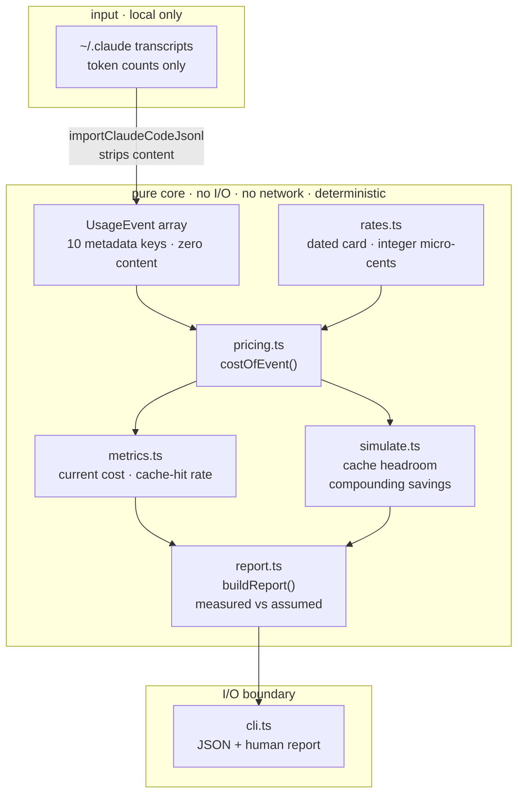

<div align="center">

# token-spread

**Make the tokens you already pay for go further — and keep the difference.**

Not by minting tokens. Not by reselling a subscription's quota (banned, and repriced to
zero margin). By serving the **same request to the same model** more cheaply than the
customer can buy it direct. That gap is the business — and it survives scrutiny only
because nothing about the request changes.

`slice 1 · read-only` &nbsp;•&nbsp; `63 tests passing` &nbsp;•&nbsp; `core verified` &nbsp;•&nbsp; `private` &nbsp;•&nbsp; `bun + TypeScript`

</div>

---

## How it works

Usage that already happened flows left → right into one auditable report. Everything
between the importer and the CLI is **pure**: no I/O, no network, no clock — so the same
input always yields the same report, and prompt content is dropped at the very first step.



**Read it as:** transcripts → the importer strips everything but token counts → every event
is priced once by `costOfEvent` (the one function the report and a future invoice must
agree on) → `metrics` and `simulate` fan out from that price → `report` folds them into a
deterministic, self-auditing object → `cli` prints it.

---

## What slice 1 reports

> *Here's what your traffic costs today, and what it would cost under caching you're
> not yet using — with the model, the prompt and the answer all unchanged.*

| Figure | What it is |
|---|---|
| **Current cost** | Real token counts × a dated rate card, to the cent. Reconciles against your bill. |
| **Cache-hit rate** | A hard number from your `cache_read` vs `input` tokens — measured, not assumed. |
| **Cache headroom** | What input cost falls to if you raise the hit rate to a target. |
| **Compounding savings** | Levers multiply, never add. Waste elimination reports `UNQUANTIFIED` until a detector measures it — never `$0`, which would read as "we looked and found none". |

### What is deliberately absent

**Model routing.** Sending cheaper traffic to a smaller model is the largest number
anyone can put on a slide, and this tool will not print it. A different model writes
different words, so the saving is paid for in output the customer did not agree to
change. It was removed from `simulate.ts` on 2026-08-11 for exactly that reason; two
tests now fail if it returns. If your workload *can* tolerate a different model, that is
the first lever to pull — it is simply not this product's lever.

## What you net

Straight answer: **this slice nets you nothing on its own — it's the meter, not the tap.**
It doesn't create tokens or move anyone's quota. What it does is put a hard number on the
spend you can recover from caching alone, with the answer unchanged.

Worked example — **100 MTok in / 10 MTok out, all Opus 5, nothing cached.** Regenerate it
with `bun run bench/margin-model.ts`; the figure below is drawn by that same script, so it
cannot drift from the model the way the previous hand-drawn one did.

| Scenario | Cost / month | Recovered |
|---|---:|---:|
| Baseline — nothing cached | **$750.00** | — |
| Cache hit raised to 90% | **$376.25** | **−$373.75 · 49.8%** |

Half the bill, same model, same prompt, same output. That is the whole claim.

<p align="center">
  <br>
  <em>Generated by <code>bench/margin-model.ts</code> from the real pricing path.</em>
</p>

**On already-cached traffic this number is zero, and the report says so.** Run against a
Claude Code history sitting at a 100% hit rate and it reports $0.00 saved — because there
is nothing left to take. A tool that always finds a saving is not measuring anything.

> ### ⚠️ Read this before quoting the number above
>
> That table measures savings against a **no-caching baseline** — which is *not* where most
> real clients start. Claude Code already places `cache_control` breakpoints and reaches a
> **~100% cache-hit rate** in practice (measured across 84,294 real assistant records), so a
> Claude Code shop's headroom from the caching lever is approximately **zero**.
>
> Treat `$432.95` as **the mechanism's ceiling**, never as a customer's expected saving. The
> honest pitch measures the customer's *actual* hit rate first and quotes them the gap.
> The teams with real headroom are the ones **hand-rolling agents on the raw API**, where no
> client library places breakpoints for them — see [ProjectDiscovery's documented 7% → 84%
> case](https://projectdiscovery.io/blog/how-we-cut-llm-cost-with-prompt-caching) (−59% to
> −70% cost, caused by working memory sitting inside the system prompt).

Two honesty notes, baked into the tool:

- **Cache savings are measured** from your real `cache_read` data — no assumed hit rate,
  no assumed traffic mix. Where a lever has no signal in the data, it reports
  `UNQUANTIFIED` rather than a flattering zero.
- Slice 1 **proves the money is there**. *Capturing* it is the gateway (slice 3).

Your real figure is whatever `bun run src/cli.ts --dir ~/.claude/projects` prints for *your*
traffic. The example is the shape, not your bill.

## Quick start

```bash
bun install                              # no runtime deps
bun test                                 # 63 tests
bun run src/cli.ts --dir ~/.claude/projects
```

## Privacy — tested, not promised

- **Local only.** Reads the filesystem, nothing else. A source-level test forbids `fetch` and URLs.
- **No content, ever.** `message.content` is never read into an event, logged, or printed — a test asserts every event has only its ten metadata keys.
- **No telemetry.** Phones nobody.

## Verified vs. assumed

| Claim | Status |
|---|---|
| Pricing exact (integer micro-cents, no float) | ✅ hand-verified |
| Content never leaks into the report | ✅ verified |
| Unknown models excluded, never guessed | ✅ verified |
| Savings compound, not additive | ✅ verified |
| Waste elimination | ⚠️ `UNQUANTIFIED` — needs retry/duplicate/zombie signals the slice-1 importer does not carry |
| Model routing | ❌ removed 2026-08-11 — a different model answering is a changed result, not a saving |

## Repo layout

```text
src/
  rates.ts          dated rate card · integer micro-cents
  pricing.ts        costOfEvent() — the one price everything agrees on
  metrics.ts        current cost · observed cache-hit rate
  simulate.ts       cache headroom · compounding attribution
  report.ts         buildReport() — deterministic, self-auditing
  cli.ts            the only I/O boundary
  importers/
    claudeCode.ts   JSONL → UsageEvent[], strips content at the door
tests/              one suite per module + a fixture-level acceptance gate
fixtures/           synthetic transcripts + hand-computed expected values
docs/specs/         the design spec (+ a rendered HTML copy)
docs/               architecture notes · worked margin model
```

## Roadmap

1. **Savings Report** (read-only) — ✅ this slice. Prove the spread is real, at zero risk.
2. **Metering ledger** — turn `UsageEvent` into a spend ledger with budgets and reservations. The data model was shaped for it.
3. **Gateway** — the metered endpoint that serves requests and captures the spread. Only after 1–2 earn it.

## Scope, stated plainly

**Permanently out of scope, not deferred:** subscription-account pooling or transfer. It's
banned under the terms and has no margin. The margin here comes entirely from caching on
**your own API key** — narrower than a routing pitch, and the only version of it that
leaves the customer's output untouched.

Full design: [`docs/specs/2026-08-08-savings-report-design.md`](docs/specs/2026-08-08-savings-report-design.md)
