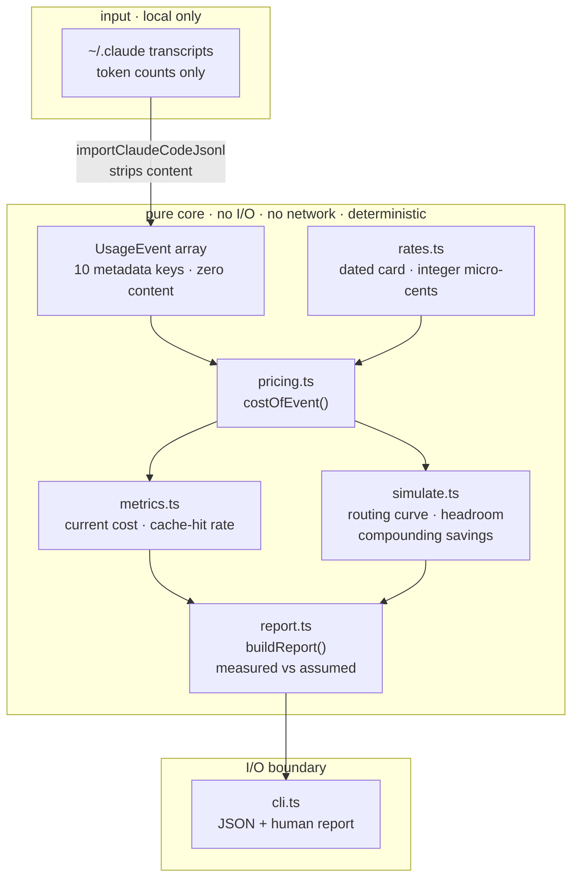
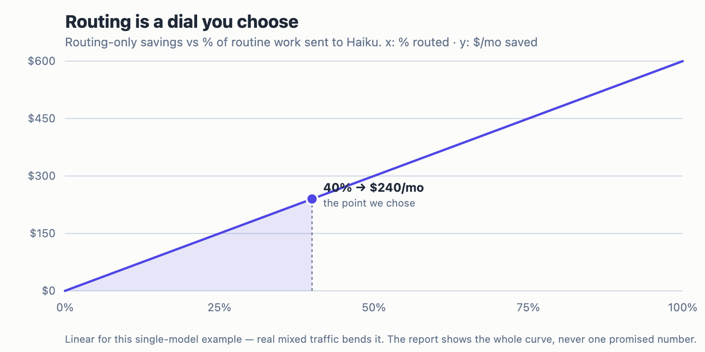

<div align="center">

# token-spread

**Make the tokens you already pay for go further — and keep the difference.**

Not by minting tokens. Not by reselling a subscription's quota (banned, and repriced to
zero margin). By serving the same request with **caching** and **routing** so it costs
*you* less than it costs your customer buying direct. That gap is the business.

`slice 1 · read-only` &nbsp;•&nbsp; `63 tests passing` &nbsp;•&nbsp; `core verified` &nbsp;•&nbsp; `private` &nbsp;•&nbsp; `bun + TypeScript`

</div>

---

## How it works

Usage that already happened flows left → right into one auditable report. Everything
between the importer and the CLI is **pure**: no I/O, no network, no clock — so the same
input always yields the same report, and prompt content is dropped at the very first step.



**Read it as:** transcripts → the importer strips everything but token counts → every event
is priced once by `costOfEvent` (the one function the report and a future invoice must
agree on) → `metrics` and `simulate` fan out from that price → `report` folds them into a
deterministic, self-auditing object → `cli` prints it.

---

## What slice 1 reports

> *Here's what your traffic costs today, and what it would cost under caching and routing
> you're not yet using.*

| Figure | What it is |
|---|---|
| **Current cost** | Real token counts × a dated rate card, to the cent. Reconciles against your bill. |
| **Cache-hit rate** | A hard number from your `cache_read` vs `input` tokens — measured, not assumed. |
| **Routing what-if** | A curve from 0 → 100% routed to a cheaper model. Never a single number dressed up as fact. |
| **Cache headroom** | What input cost falls to if you raise the hit rate to a target. |
| **Compounding savings** | `cacheOnly`, `routingOnly`, `combined` — and `combined < cacheOnly + routingOnly`, because the levers overlap. No misleading sum. |

## What you net

Straight answer: **this slice nets you nothing on its own — it's the meter, not the tap.**
It doesn't create tokens or move anyone's quota. What it does is put a hard number on the
spend you can recover once you turn caching and routing on. On a heavy-Opus month, that
number is large.

Worked example — **100 MTok in / 10 MTok out, all Opus, no optimization** (computed from
this repo's own code, not quoted from a doc):

| Scenario | Cost / month | Recovered |
|---|---:|---:|
| Baseline — no optimization | **$750.00** | — |
| Cache alone (70% hit) | $466.25 | −$283.75 |
| Routing alone (40% → Haiku) | $510.00 | −$240.00 |
| **Both, compounded** | **$317.05** | **−$432.95 · 57.7%** |

Same output, **~42% of the cost** — your dollar stretches **2.37× further**. The two levers
overlap, so the combined saving ($432.95) is *less* than the naive sum ($523.75); the report
never shows the inflated sum.

<p align="center">
  <br>
  <em>The overlap (amber) is added back on purpose — the levers compound, they don't sum.</em>
</p>

<p align="center">
  <br>
  <em>Routing is an operator-set what-if — the report shows the whole dial, not one promised number.</em>
</p>

Two honesty notes, baked into the tool:

- **Cache savings are measured** from your real `cache_read` data. **Routing is an
  operator-set what-if** (40% here) — the report shows a curve, never a promise.
- Slice 1 **proves the money is there**. *Capturing* it is the gateway (slice 3).

Your real figure is whatever `bun run src/cli.ts --dir ~/.claude/projects` prints for *your*
traffic. The example is the shape, not your bill.

## Quick start

```bash
bun install                              # no runtime deps
bun test                                 # 63 tests
bun run src/cli.ts --dir ~/.claude/projects
```

## Privacy — tested, not promised

- **Local only.** Reads the filesystem, nothing else. A source-level test forbids `fetch` and URLs.
- **No content, ever.** `message.content` is never read into an event, logged, or printed — a test asserts every event has only its ten metadata keys.
- **No telemetry.** Phones nobody.

## Verified vs. assumed

| Claim | Status |
|---|---|
| Pricing exact (integer micro-cents, no float) | ✅ hand-verified |
| Content never leaks into the report | ✅ verified |
| Unknown models excluded, never guessed | ✅ verified |
| Savings compound, not additive | ✅ verified |
| Routable fraction | ⚠️ operator-set what-if by design — no per-request difficulty label until a later slice |

## Repo layout

```text
src/
  rates.ts          dated rate card · integer micro-cents
  pricing.ts        costOfEvent() — the one price everything agrees on
  metrics.ts        current cost · observed cache-hit rate
  simulate.ts       routing curve · cache headroom · compounding attribution
  report.ts         buildReport() — deterministic, self-auditing
  cli.ts            the only I/O boundary
  importers/
    claudeCode.ts   JSONL → UsageEvent[], strips content at the door
tests/              one suite per module + a fixture-level acceptance gate
fixtures/           synthetic transcripts + hand-computed expected values
docs/specs/         the design spec (+ a rendered HTML copy)
docs/               architecture notes · worked margin model
```

## Roadmap

1. **Savings Report** (read-only) — ✅ this slice. Prove the spread is real, at zero risk.
2. **Metering ledger** — turn `UsageEvent` into a spend ledger with budgets and reservations. The data model was shaped for it.
3. **Gateway** — the metered endpoint that serves requests and captures the spread. Only after 1–2 earn it.

## Scope, stated plainly

**Permanently out of scope, not deferred:** subscription-account pooling or transfer. It's
banned under the terms and has no margin. The margin here comes entirely from caching and
routing on **your own API key** — which is wider than the closed route ever offered.

Full design: [`docs/specs/2026-08-08-savings-report-design.md`](docs/specs/2026-08-08-savings-report-design.md)
