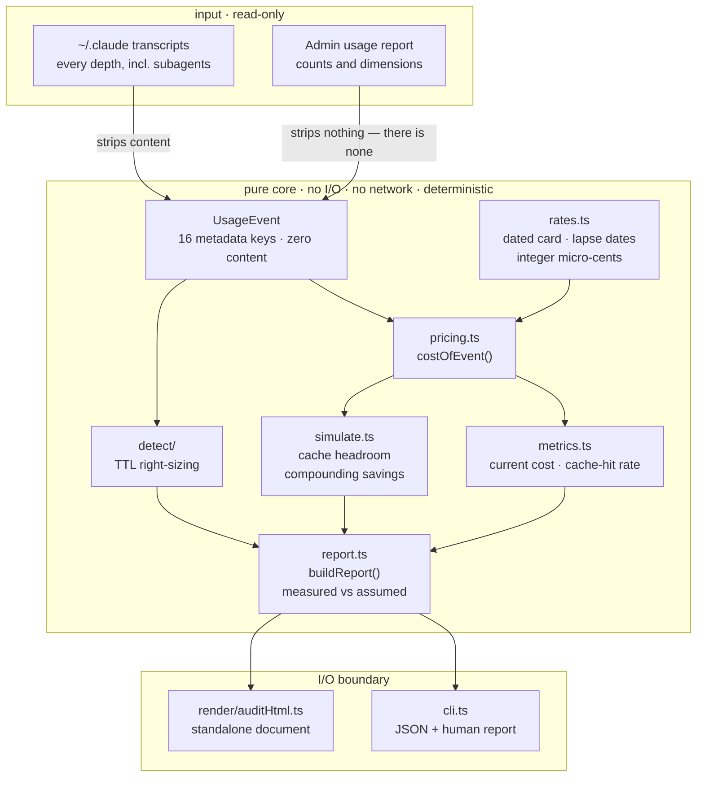

<div align="center">


<br>

**Make the tokens you already pay for go further — and keep the difference.**

Not by minting tokens. Not by reselling a subscription's quota (banned, and repriced to
zero margin). By serving the **same request to the same model** more cheaply than the
customer can buy it direct. That gap is the business — and it survives scrutiny only
because nothing about the request changes.

`194 tests` &nbsp;·&nbsp; `0 bytes written` &nbsp;·&nbsp; `0 prompts read` &nbsp;·&nbsp; `no runtime dependencies` &nbsp;·&nbsp; `bun + TypeScript`

<sub>Code **[MIT](LICENSE)** · the register **[CC BY 4.0](docs/research/LICENSE)** — quote any
verdict, credit the source, so a correction can reach you. [How to cite](CITATION.cff)</sub>

</div>

```bash
git clone https://github.com/hangryclaude/token-spread.git && cd token-spread
bun install && bun run audit
```

Reads `~/.claude/projects`. Writes nothing. Sends nothing. Prints your real cache-hit rate and
what — if anything — is actually recoverable. On a machine that already caches well the honest
answer is a small number, and you should get a small number.

---

## The bar


One question decides whether a saving is real:

> Does the model read a different sequence of tokens, does a different model answer, or
> does a different amount of thinking happen?

If the answer is yes it is not a saving — it is a changed product sold as one. That rules
out the largest number anyone can put on a slide. What is left is smaller, and true:

| Lever | Evidence | What actually changes |
|---|---|---|
| Cache-hit headroom | `PASS_METADATA` | which rate a token bills at |
| Cache-write TTL right-sizing | `PASS_METADATA` | how long a prefix is stored |
| Compaction accounting | `PASS_ABSOLUTE` | nothing — it corrects a mis-read bill |
| Batch tier | `CONTRACTUAL_ONLY` | when the work runs. Off by default |

187 candidate techniques were adjudicated against that question — **67 pass**, **28 pass on
the provider's word alone**, **52 rejected**, **40 unresolved**. Those four add to 187; a
register that quietly drops a category is doing the thing it exists to prevent. The working is in
[`docs/research/2026-08-10-strict-identity-register.md`](docs/research/2026-08-10-strict-identity-register.md).

**Take the whole thing.** The register is two JSON files at stable paths, CC BY 4.0 — no API, no
signup, no rate limit:

```bash
curl -sL https://raw.githubusercontent.com/hangryclaude/token-spread/main/docs/research/2026-08-10-verdicts-final.json
curl -sL https://raw.githubusercontent.com/hangryclaude/token-spread/main/docs/research/2026-08-12-addendum.json
```

The format is documented in [`SCHEMA.md`](docs/research/SCHEMA.md) and enforced by
[`tests/registerSchema.test.ts`](tests/registerSchema.test.ts) on every run. Verdicts carry a
`corrections` array — dated, typed, appended and never edited away — so a claim you quoted last
month can be checked against what it says today.

<div align="center">


<sub>Rendered by <a href="docs/media/render.mjs"><code>docs/media/render.mjs</code></a> — the four
counts are read from the verdict file at render time, never typed into the film.</sub>

</div>

---

## The deliverable

`--html` writes a standalone document: no remote stylesheet, no webfont, no script. It
opens offline, from an attachment, on a machine that has never heard of this tool.

<div align="center">

</div>

Every figure sits beside the events and the dated rate card that produced it. Anything that
**cannot** be measured says so rather than being dropped — on an aggregate usage report the
1-hour cache-write volume appears as *exposure*, never as a saving, because the gap between
consecutive turns that would decide it is not in that data.

---

## Two ways in

```bash
git clone https://github.com/hangryclaude/token-spread.git
cd token-spread && bun install
```

**A machine running Claude Code** — reads `~/.claude/projects` at every depth, including the
subagent transcripts five levels down that hold most of an agent-heavy bill:

```bash
bun run audit --html audit.html
```

**An organisation running the API** — reads Anthropic's own usage report. The customer
produces the file with one curl on their own machine; no admin key is read here, and nothing
is sent anywhere:

```bash
curl https://api.anthropic.com/v1/organizations/usage_report/messages \
  -H "anthropic-version: 2023-06-01" -H "x-api-key: $ANTHROPIC_ADMIN_KEY" \
  -G --data-urlencode "starting_at=2026-07-01T00:00:00Z" \
     --data-urlencode "bucket_width=1d" \
     --data-urlencode "group_by[]=model" \
     --data-urlencode "group_by[]=workspace_id" \
     --data-urlencode "group_by[]=service_tier" > usage.json

bun run audit --admin usage.json --html audit.html
```

`bun run audit --help` lists every flag. An unknown flag is refused rather than
ignored, and a directory with no transcripts exits non-zero rather than reporting a
confident `$0.00` — finding no input is not the same as finding no spend.

Every flag, and how to prove the read-only property yourself, is in
[`RUNNING.md`](RUNNING.md).

---

## It only reads


Not a claim — a property the suite defends. Five tests in
[`tests/readOnly.test.ts`](tests/readOnly.test.ts) spawn the real CLI against a temporary
transcript tree and assert that after a full run every input file is **byte-identical**
(content hash, size and mtime), **no file was created**, the same input gives the **same
numbers**, **no prompt text** reaches output though the fixture plants a canary, and
`--html` writes **exactly one** file at the path you named.

The fingerprint hashes contents, not just size and mtime — verified by mutating a same-size
file and confirming it moves. The only write in the program is `Bun.write(htmlOut)`.

---

## How it works

Usage that already happened flows left → right into one auditable report. Everything
between the importer and the CLI is **pure**: no I/O, no network, no clock — so the same
input always yields the same report, and prompt content is dropped at the very first step.



**Read it as:** transcripts → the importer strips everything but token counts → every event
is priced once by `costOfEvent` (the one function the report and a future invoice must
agree on) → `metrics` and `simulate` fan out from that price → `report` folds them into a
deterministic, self-auditing object → `cli` prints it.

---

## What slice 1 reports


> *Here's what your traffic costs today, and what it would cost under caching you're
> not yet using — with the model, the prompt and the answer all unchanged.*

| Figure | What it is |
|---|---|
| **Current cost** | Real token counts × a dated rate card, to the cent. Reconciles against your bill. |
| **Cache-hit rate** | A hard number from your `cache_read` vs `input` tokens — measured, not assumed. |
| **Cache headroom** | What input cost falls to if you raise the hit rate to a target. |
| **Compounding savings** | Levers multiply, never add. Waste elimination reports `UNQUANTIFIED` until a detector measures it — never `$0`, which would read as "we looked and found none". |

### What is deliberately absent

**Model routing.** Sending cheaper traffic to a smaller model is the largest number
anyone can put on a slide, and this tool will not print it. A different model writes
different words, so the saving is paid for in output the customer did not agree to
change. It was removed from `simulate.ts` on 2026-08-11 for exactly that reason; two
tests now fail if it returns. If your workload *can* tolerate a different model, that is
the first lever to pull — it is simply not this product's lever.

## What you net

Straight answer: **this slice nets you nothing on its own — it's the meter, not the tap.**
It doesn't create tokens or move anyone's quota. What it does is put a hard number on the
spend you can recover from caching alone, with the answer unchanged.

Worked example — **100 MTok in / 10 MTok out, all Opus 5, nothing cached.** Regenerate it
with `bun run bench/margin-model.ts`; the figure below is drawn by that same script, so it
cannot drift from the model the way the previous hand-drawn one did.

| Scenario | Cost / month | Recovered |
|---|---:|---:|
| Baseline — nothing cached | **$750.00** | — |
| Cache hit raised to 90% | **$376.25** | **−$373.75 · 49.8%** |

Half the bill, same model, same prompt, same output. That is the whole claim.

<p align="center">
  <br>
  <em>Generated by <code>bench/margin-model.ts</code> from the real pricing path.</em>
</p>

**On already-cached traffic this number is zero, and the report says so.** Run against a
Claude Code history sitting at a 100% hit rate and it reports $0.00 saved — because there
is nothing left to take. A tool that always finds a saving is not measuring anything.

> ### ⚠️ Read this before quoting the number above
>
> That table measures savings against a **no-caching baseline** — which is *not* where most
> real clients start. Claude Code already places `cache_control` breakpoints and reaches a
> **~100% cache-hit rate** in practice (measured across 84,294 real assistant records), so a
> Claude Code shop's headroom from the caching lever is approximately **zero**.
>
> Treat `$432.95` as **the mechanism's ceiling**, never as a customer's expected saving. The
> honest pitch measures the customer's *actual* hit rate first and quotes them the gap.
> The teams with real headroom are the ones **hand-rolling agents on the raw API**, where no
> client library places breakpoints for them — see [ProjectDiscovery's documented 7% → 84%
> case](https://projectdiscovery.io/blog/how-we-cut-llm-cost-with-prompt-caching) (−59% to
> −70% cost, caused by working memory sitting inside the system prompt).

Two honesty notes, baked into the tool:

- **Cache savings are measured** from your real `cache_read` data — no assumed hit rate,
  no assumed traffic mix. Where a lever has no signal in the data, it reports
  `UNQUANTIFIED` rather than a flattering zero.
- Slice 1 **proves the money is there**. *Capturing* it is the gateway (slice 3).

Your real figure is whatever `bun run src/cli.ts --dir ~/.claude/projects` prints for *your*
traffic. The example is the shape, not your bill.

## Quick start

```bash
bun install                              # no runtime deps
bun run test        # 194 tests
bun run typecheck   # no type errors
bun run src/cli.ts --dir ~/.claude/projects
```

## Privacy — tested, not promised

- **Local only.** Reads the filesystem, nothing else. A source-level test forbids `fetch` and URLs.
- **No content, ever.** `message.content` is never read into an event, logged, or printed — a test asserts every event carries only its metadata keys and nothing else.
- **No telemetry.** Phones nobody.

## What it refuses to do

A tool that always finds a saving is not measuring anything.

| Refusal | Why |
|---|---|
| Won't route to a cheaper model | a different model writes different words |
| Won't price an unknown model | excluded and counted, never guessed |
| Won't price `flex` / `priority` tiers | no published multiplier exists; refused as `unknown_tier` |
| Won't claim waste it cannot see | reports `UNQUANTIFIED`, not a flattering `$0` |
| Won't size TTL from aggregates | exposure without the timing that would make it a saving |
| Won't sum levers | multipliers compound by product; a sum overstates |

## Verified vs. assumed


| Claim | Status |
|---|---|
| Pricing exact (integer micro-cents, no float) | ✅ hand-verified |
| Content never leaks into the report | ✅ verified |
| Unknown models excluded, never guessed | ✅ verified |
| Savings compound, not additive | ✅ verified |
| Waste elimination | ⚠️ `UNQUANTIFIED` — needs retry/duplicate/zombie signals the slice-1 importer does not carry |
| Model routing | ❌ removed 2026-08-11 — a different model answering is a changed result, not a saving |

## Repo layout

```text
src/
  rates.ts               dated rate card · lapse dates · integer micro-cents
  pricing.ts             costOfEvent() — the one price everything agrees on
  metrics.ts             current cost · observed cache-hit rate
  simulate.ts            cache headroom · compounding attribution
  evidence.ts            the tier boundary, as a type
  detect/
    ttlRightSizing.ts    1h writes re-read inside 5 minutes
  report.ts              buildReport() — deterministic, self-auditing
  render/
    auditHtml.ts         the standalone audit document
  walk.ts                transcript discovery, every depth
  cli.ts                 the only I/O boundary
  importers/
    claudeCode.ts        JSONL → UsageEvent[], strips content at the door
    adminUsageReport.ts  org usage report → UsageEvent[]
tests/                   one suite per module + acceptance and read-only gates
fixtures/                synthetic transcripts + hand-computed expected values
bench/optical/           does text-as-an-image buy context? (it does not)
docs/research/           the registers
docs/specs/              the design spec (+ a rendered HTML copy)
```

## Research


| Document | |
|---|---|
| [Strict identity register](docs/research/2026-08-10-strict-identity-register.md) | the first 176, 66 passing, six dated errata — one of which was itself wrong |
| [Addendum, 2026-08-12](docs/research/2026-08-12-addendum.json) | 8 more from nine adversarial sweeps, each re-verified against its primary source by hand |
| [Context survival register](docs/research/2026-08-11-context-survival-register.md) | the behaviour-affecting tier, measured and kept separate |
| [Optical compression bench](bench/optical/README.md) | 2.07× at 93.9% blind recall, against 20–100× from delegation |

The explainer cards above are composed by [`docs/media/cards.mjs`](docs/media/cards.mjs): the
backdrops are generated with fal ([`docs/media/fal.mjs`](docs/media/fal.mjs), prompts and seeds
recorded in `docs/media/art/provenance.json`), and every word and figure on top is real HTML.
The split is deliberate — a diffusion model cannot be trusted with a number, and the counts are
read out of the register at compose time rather than typed, so a card cannot drift from the data
the way three hand-maintained copies of the same tally already did.

## Where this sits

Honest version, with the numbers that are not flattering:

| | stars | what it does |
|---|---|---|
| [ccusage](https://github.com/ccusage/ccusage) | **17,882** | reads the same transcripts, shows you the spend. Free, excellent, and further along than this |
| [claude-mem](https://github.com/thedotmack/claude-mem) | **90,542** | adjacent problem — memory across sessions |
| **token-spread** | **0** | adjudicates whether a saving is real, and publishes what it rejected |

Star counts read from the GitHub API on 2026-08-13. If you want a spend dashboard today, ccusage
is the better answer and you should use it.

What is here and nowhere else: **a register that publishes its rejections, its unresolved bucket,
and its own errata.** A competitor teardown checked fourteen companies and two OSS projects and
found no equivalent — no published rejection list, no unresolved count, no errata. On 2026-08-12
this register expelled four entries from its own passing column when their cited tools turned out
to be zero-star repositories and one could not be found at all; the published pass count fell
from 70 to 66 and the site said so on the page.

That is the whole claim, and it is deliberately narrow. It is not "best audit tool". It is: when
this tells you a saving is real, you can check why, and when it is wrong you can watch it say so.

## Roadmap

1. **Savings Report** (read-only) — ✅ this slice. Prove the spread is real, at zero risk.
2. **Metering ledger** — turn `UsageEvent` into a spend ledger with budgets and reservations. The data model was shaped for it.
3. **Gateway** — the metered endpoint that serves requests and captures the spread. Only after 1–2 earn it.

## Scope, stated plainly

**Permanently out of scope, not deferred:** subscription-account pooling or transfer. It's
banned under the terms and has no margin. The margin here comes entirely from caching on
**your own API key** — narrower than a routing pitch, and the only version of it that
leaves the customer's output untouched.

Full design: [`docs/specs/2026-08-08-savings-report-design.md`](docs/specs/2026-08-08-savings-report-design.md)
