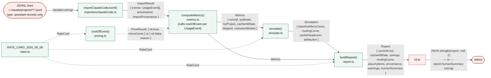
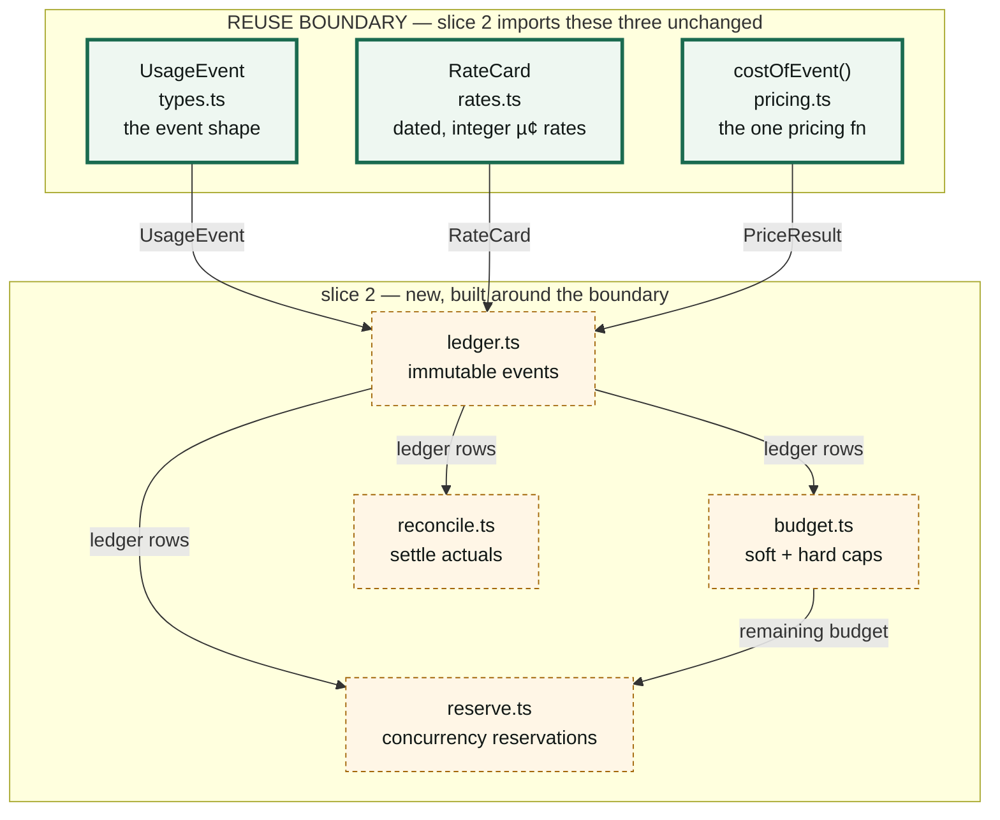
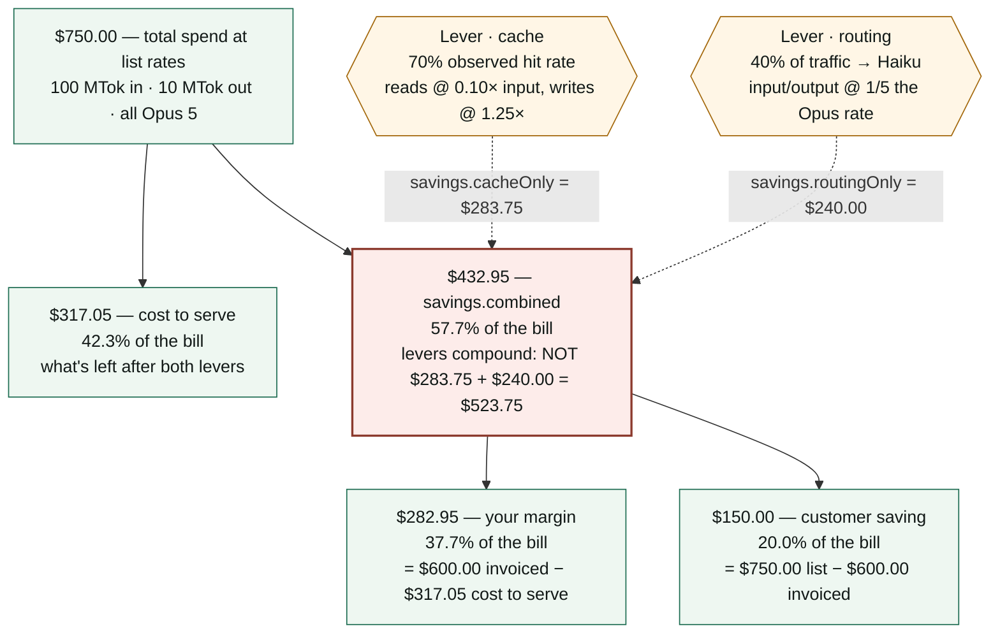

# token-spread — architecture

Slice 1: read-only savings report. Reads local Claude Code transcripts, recomputes
what they cost, measures the real cache-hit rate, and simulates two savings levers.
No storage, no network egress beyond the (unbuilt) admin importer, no prompt content.
Source: `docs/specs/2026-08-08-savings-report-design.md`.

---

## 1. File tree — one line per unit, pure or I/O

`pure` = no filesystem, no clock, no network, no global state — same input always
gives the same output. `I/O` = touches the filesystem, spawns a process, or reads
the system clock.

```
src/
├── types.ts                    UsageEvent interface + USAGE_EVENT_KEYS constant       [pure]
├── rates.ts                    RATE_CARD_2026_08_08 (integer µ¢/token) + cardAgeDays() [pure]
├── pricing.ts                  costOfEvent() — the one pricing fn; microCentsToCents,
│                                formatCents                                            [pure]
├── metrics.ts                  computeMetrics(): UsageEvent[] → totals/byModel/
│                                byProject/cacheHitRate; measuredCacheWriteOverheadPct() [pure]
├── simulate.ts                 simulate(): routing curve, cache headroom, and the
│                                cache/routing/combined savings attribution            [pure]
├── report.ts                   buildReport(): assembles the Report object, warnings,
│                                humanSummary                                          [pure]
├── cli.ts                      wiring only: walks ~/.claude/projects, reads each
│                                .jsonl, runs the pipeline, prints JSON or text        [I/O — fs reads, Bun.file, console, process.exit]
└── importers/
    └── claudeCode.ts           importClaudeCodeJsonl(): JSONL lines → UsageEvent[],
                                 strips everything but the metered fields              [pure — takes Iterable<string>, does not open files itself]

tests/
├── pricing.test.ts             costOfEvent unit tests — hand-computed expectations    [pure]
├── rates.test.ts               rate-card shape: non-negative, divides exactly (§6.1)  [pure]
├── simulate.test.ts            routing/cache curves, the compounding-not-additive
│                                assertion (combined < cacheOnly + routingOnly)        [pure — builds Metrics fixtures in code]
├── importer.test.ts            assistant-only filtering, dedup, synthesized-key
│                                provenance, content-leak assertions                   [I/O — reads fixtures/*.jsonl]
├── metrics.test.ts             current cost to the cent, byModel/byProject splits     [I/O — reads fixtures/*.jsonl]
├── report.test.ts              humanSummary content, measured-vs-operator_set tags    [I/O — reads fixtures/*.jsonl]
├── acceptance.test.ts          cross-cutting spec acceptance criteria (integer
│                                pricing path, no-egress importer)                     [I/O — reads fixtures/*.jsonl, stubs network]
└── cli.test.ts                 spawns `bun run src/cli.ts` as a subprocess, checks
                                 stdout/exit code                                      [I/O — Bun.spawn]
```

`fixtures/*.jsonl` (`mixed`, `malformed`, `dupes`, `nokey`) are the synthetic,
hand-computed inputs §10 of the spec requires — no real transcripts in the suite.

---

## 2. Data path — JSONL to CLI output

Every arrow is labelled with the type that crosses it.



Solid arrows are the primary event flow; dashed arrows are the `RateCard` and
`PriceResult` side-inputs each pure stage needs. `cli.ts` is the only red (I/O) node
— every stage between the JSONL bytes and the printed string is deterministic.

---

## 3. Slice-1 / slice-2 boundary — reuse, not rebuild

`UsageEvent`, `RateCard`, and `costOfEvent()` are the three units slice 2 imports
**unchanged** (spec §7.1). Slice 2 adds four new files that wrap storage and
policy *around* them; if slice 2 ever needs to edit inside the green box, that's a
design-review signal, not a patch.



The thick green box is the whole of what slice 1's "no global mutable state, no
module-level accumulator, no hardcoded `accountId`" constraint (spec §7.1) buys:
slice 2 bolts storage onto it without touching a tested line inside.

---

## 4. Where a dollar of customer spend goes

Worked example from `docs/margin-model.html` and spec §6.7: 100 MTok in, 10 MTok
out, all `claude-opus-5`, 70% cache-hit, 40% routed to `claude-haiku-4-5`. Cache
reads bill at 0.10× input, cache writes at 1.25×; Haiku input/output is 1/5 of
Opus. `savings.cacheOnly` and `savings.routingOnly` are the spec's non-compounding
per-lever figures — shown to make the compounding rule visible, not to be summed.



Check: $317.05 + $432.95 = $750.00. $282.95 + $150.00 = $432.95. The two levers
don't just discount the bill — they shrink real upstream cost, and the resulting
gap is what gets split between the operator's margin and the customer's saving.
